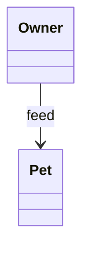
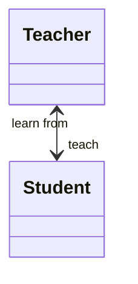
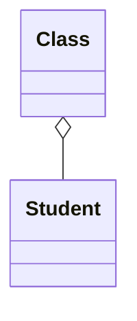
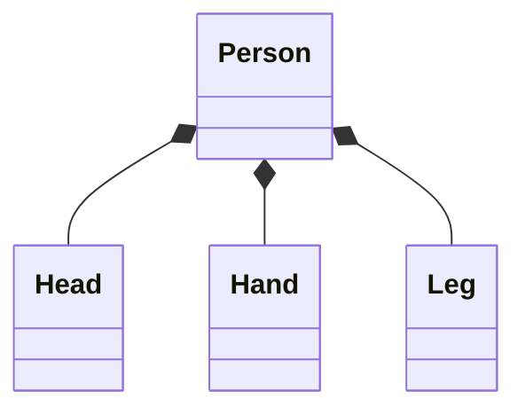
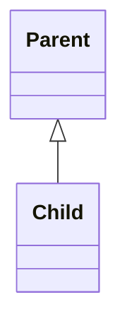

在类图中，方块表示类，连线表示类之间的关系

# 关联 association

关联是一种非常宽泛的关系，如果两个类之间需要通信，就是关联关系

连线格式为普通箭头，箭头方向表示通信方向

可以存在双向通信关系，箭头为双向箭头

# 聚合 aggregation

一个类，内部包含其它类的实例

不存在强的生命周期约束，没有强独占性

学生本身是独立存在的，但是班级主动和学生产生了聚合关系

一个班级中包含多个学生，如果班级不存在，学生仍旧可存在，班级的生命周期不影响学生

连线为空心的菱形

# 组合 composition

一个类，内部包含其它类的实例

有强生命周期关联

一个 person，由 head hand leg 等器官组成

假如这个人的生命结束，这些器官存在就失去了意义

有一种独占性，Head 只归属于 Person 所有，没有其它类和其产生关系

连线为实心的菱形

# 继承，泛化 inheritance / generalization

类的继承关系，连线格式为空心三角箭头

