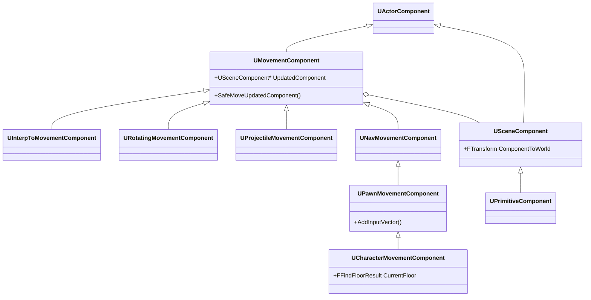

- [x] 武器应该做成 socket attach的方式，还是和人物模型统一的方式？ ✅ 2024-04-13
	- 统一方式，有专属的bone attach 武器，更灵活的动画
	- 武器固定，所有武器和人物同一模型，无法切换更多武器
	- socket方式，随意切换武器
	- 但相对bone的位置固定，在动画中死板
	- 两者相结合
	- 用 weapon bone 做动画
	- 新武器 attach 到其上

| general settings                                | desc                                                                                       |
| ----------------------------------------------- | ------------------------------------------------------------------------------------------ |
| gravity scale                                   | 重力本身的基础上乘以 factor                                                                          |
| max acceleration                                | 最大加速度，单位 $cm/s^2$                                                                          |
| use separate braking friction                   | 是否在没有加速度 or 超过 max speed 需要回来 时，使用 braking friction 系数；否则使用默认 friction 系数如 ground friction |
| braking friction                                | 停止时的摩擦系数                                                                                   |
| braking friction factor                         | 停止时的摩擦系数 scale factor                                                                      |
| crouched half height                            | crouch 状态下 capsule 的半高                                                                     |
| mass                                            | 物理质量 用于 addforce addimpulse 单位 kg                                                          |
| default land movement mode                      | 默认不在水中的 mode                                                                               |
| default water movement mode                     | 默认在水中的 mode                                                                                |
| ------------------------                        | -------------------------------------------                                                |
| braking sub step time                           | 计算 braking 减速时，在 delta time 中使用 sub step 的间隔，区间 （0.0166, 0.05）(1/75, 1/20)                 |
| enable scoped movement updates                  |                                                                                            |
| enable server dual move scoped movement updates |                                                                                            |
| run physics with no controller                  |                                                                                            |
| max simulation time step                        |                                                                                            |
| max simulation iterations                       |                                                                                            |
| max jump apex attempts per simulation           |                                                                                            |
| max depenetration with geometry                 |                                                                                            |
| max depenetration with geometry as porxy        |                                                                                            |
| max depenetration with pawn                     |                                                                                            |
| max depenatration with pawn as proxy            |                                                                                            |
| requested move use acceleration                 |                                                                                            |

| walking                             | desc                                                                                                                   |
| ----------------------------------- | ---------------------------------------------------------------------------------------------------------------------- |
| max step height                     | 可上台阶的最大高度                                                                                                              |
| walkable floor angle                | 可walk的最大斜坡度数，用于用户设置                                                                                                    |
| walkable floor z                    | 只读，$= cos(deg2rad(WalkableFloorAngle))$，真正在内部计算起作用的量                                                                   |
| ground friction                     | walk 的摩擦系数                                                                                                             |
| max walk speed                      | walk 最大速度；falling 最大横向速度                                                                                               |
| max walk speed crouched             | walk 并 crouch 时的最大速度                                                                                                   |
| min analog walk speed               | 手柄摇杆输入，最低速度；因为范围为 0-1，速度可能非常小，这里限定一个min值，在输入过小的时候，也保持这个速度                                                              |
| braking deceleration walking        | walking mode，减速时的加速率，生成的加速度和速度相反                                                                                       |
| sweep while nav walking             | nav walk 时是否使用 sweep                                                                                                   |
| can walk off ledges                 | 是否可以走下ledge（比台阶更高的）                                                                                                    |
| can walk off ledges when crounching | crouch 时是否可下 ledge                                                                                                     |
| maintain horizontal ground velocity | 在斜坡上走，使用水平方向投影速度 or 和斜坡角度平行的速度                                                                                         |
| ignore base rotation                | true，不跟随脚下的base旋转而旋转，在world中始终面向一个方向；false 脚下的base旋转会影响character的面向                                                    |
| perch radius threshold              | 非负值；对 ledge 生效；如果 [[#^b5c72e]] > threshold，角色就可以停留，不会falling; 也是 can't walk off ledge 的极限位置；                           |
| perch additional height             | this + max step height，决定当前是否当前的高度是否需要 perch；如果当前高度较小，则和 step 一样 perch（相当于 threshold = 0）；如果高度较大，考虑 threshold 进行 perch |
| ledge check threshold               |                                                                                                                        |
| always check floor                  | 是否一直进行floor检测；如果静止，理论上不用一直检测；但如果站立在可移动的平台上，就需要一直检测                                                                     |
| use flat base for floor checks      | 在检测floor时，用capsule最低点的平面，而不是圆形；默认在边缘时 capsule 会慢慢下滑，使用平面检测时，人物要么在平面上，要么从边缘落下                                           |

![[Pasted image 20240415191637.png]]

capsule 与 ledge 角的接触点，与 capsule 边缘的距离

- character movement jumping falling
	- jump z velocity
		- 起跳瞬间的垂直速度
	- braking deceleration falling
		- falling 时，水平方向的减速度，当没有输入加速度时
	- air control ^9775ab
		- falling 时，玩家输入对水平速度的掌控度
		- 0 无控制
		- 1 完全以 max walk speed 控制
	- air control boost multiplier ^0a9744
	- air control boost velocity threshold
		- 空中加速阶段
		- falling 时，水平速度小于此值，[[#^9775ab]] 乘以 [[#^0a9744]]
	- falling lateral friction
		- falling 时水平速度的摩擦
	- [ ] impart base velocity x
	- impart base velocity y
	- impart base velocity z
	- [ ] impart base angular velocity
	- notify apex
		- true
			- 触发 controller 的 notifyjumpapex() event
			- 在跳跃到顶点时
			- 其它mode转到 falling mode 时也会触发？
		- false
- swimming
	- max swim speed
	- braking deceleration swimming
	- buoyancy
		- 浮力
- flying
	- max fly speed
	- braking deceleration flying
- custom movement
	- max custom movement speed
		- 给 custom 留下的参数
- rotation settings
	- rotation rate
		- 在 xyz 3轴上的旋转速度，使 cap 过渡到新方向的速度
		- 负值，表示无限大，立即转向
	- use controller desired rotation ^6233db
		- 配合 rotation rate
		- true
			- 旋转 cap 朝向 controller rotation 的方向
		- 与 use controller rotation yaw 冲突
	- orient rotation to movement
		- 和rotatoin rate 相配合
		- true
			- 旋转 cap 向角色的加速度方向
		- 覆盖 [[#^6233db]] 选项
		- 与 use controller rotation yaw 冲突
	- 如果都没有选择，则不旋转 cap
- physics interaction
	- enable physics interaction
	- touch force scaled to mass
	- push force scaled to mass
	- push force using zoffset
	- scale push force to velocity
	- standing downward force scale
	- initial push force factor
	- push force factor
	- push force point zoffset factor
	- touch force factor
	- min touch force
	- max touch force
	- repulsion force
- character movement
	- ignore client movement error checks and correction
		- 
	- server accept client authoritative position
- avoidance
	- use RVO avoidance
	- avoidance consideration radius
	- avoidance weight
- nav mesh movement
	- project nav mesh walking
	- nav mesh projection interval
	- nav mesh projection interp speed
	- nav mesh projection height scale up
	- nav mesh projection height scale down
	- nav walking floor dist tolerance

来自父类的设置项

类图

- [ ] 如何实时调试 movement 组件效果
	- 各种数值，量化出移动效果