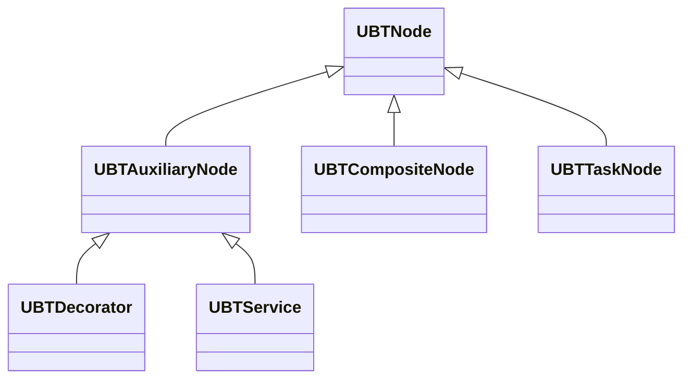

behavior tree 节点类图

- [ ] lua module 的定义
	- 何时使用 ：.
	- 区别只在于隐式的 self
	- 和 require 如何配合
- [ ] Unlua 对于增强输入的绑定回调
- [ ] 协程与 delay 的配合
- [ ] 热更新的使用和原理
- [ ] lua代码 --- 注释
	- https://github.com/LuaLS/lua-language-server/wiki/Annotations
- [ ] unlua load uobject vs load uclass

在 bp 中新建 uobject
使用节点  construct object from class
![[Pasted image 20240421225140.png]]

bp 新建 actor 使用
spawn actor from class
![[Pasted image 20240421225221.png]]

