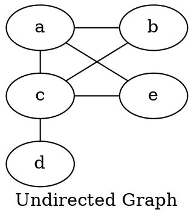
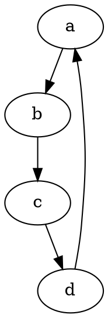
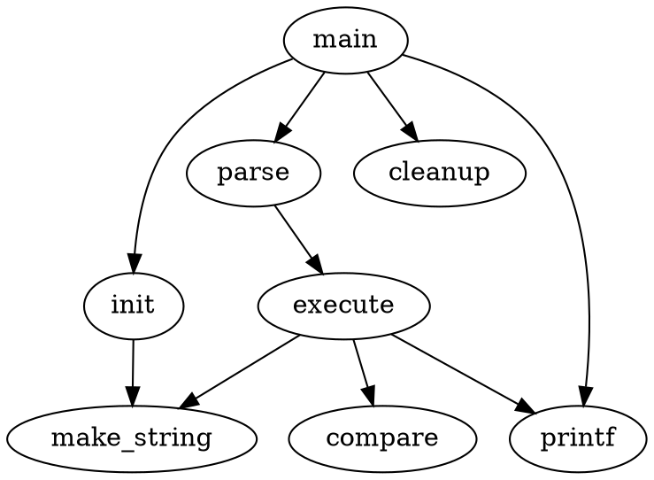
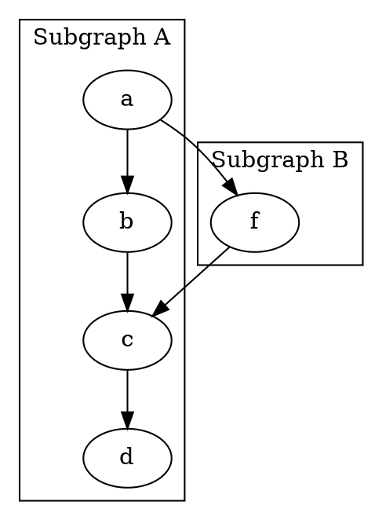
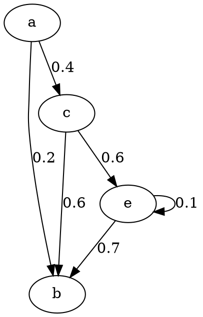
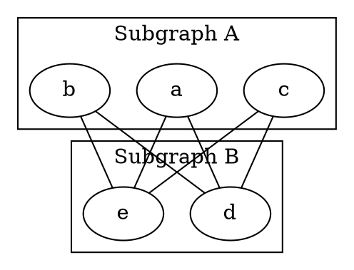
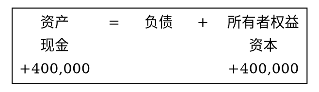
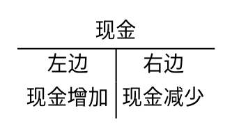

## usage {#usage}

安装相应软件包

```text
$ pacman -S graphviz xdot
```

新建 `test.dot` 文件，保存绘图代码。

使用 xdot 实时预览，

```text
$ xdot test.dot
```

绘图结果，生成 png 图片，

```text
$ dot -Tpng -o test.png test.dot
```


## graph {#graph}


### undirected {#undirected}






### directed {#directed}






### subgraph {#subgraph}


#### asynomous {#asynomous}






#### named {#named}

Subgraph name must start with prefix `cluster`.






## edge {#edge}


### label {#label}






### straight line {#straight-line}






## table {#table}










## Resources {#resources}

-   [dot guide](https://www.graphviz.org/pdf/dotguide.pdf), official manual, precise and clear
-   other links
    -   <https://blog.csdn.net/youwen21/article/details/98397993>
    -   <https://www.cnblogs.com/shuqin/p/11897207.html>
    -   <https://stackoverflow.com/questions/10147619/how-can-i-reverse-the-direction-of-every-edge-in-a-graphviz-dot-language-graph>
    -   <https://stackoverflow.com/questions/43599738/graphviz-alignment-of-subgraph>
    -   <https://renenyffenegger.ch/notes/tools/Graphviz/examples/index>
    -   <https://graphs.grevian.org/reference>
    -   <http://graphviz.org/doc/info/attrs.html>


## License {#license}


