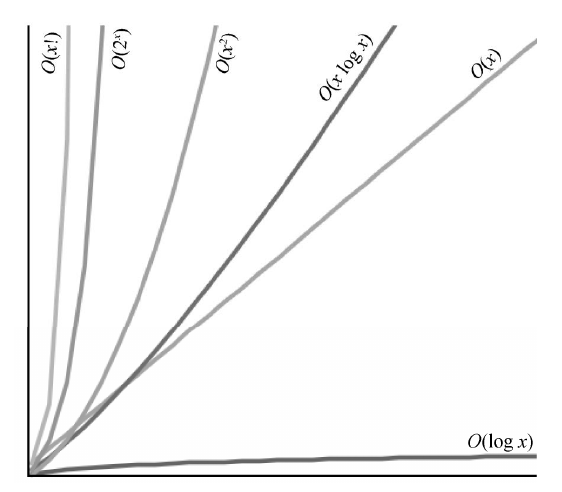
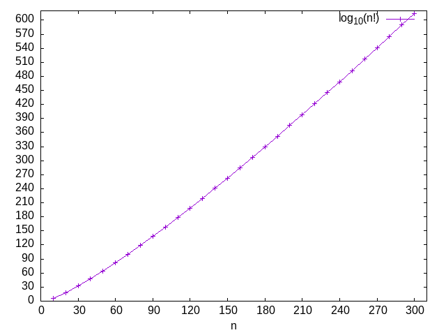
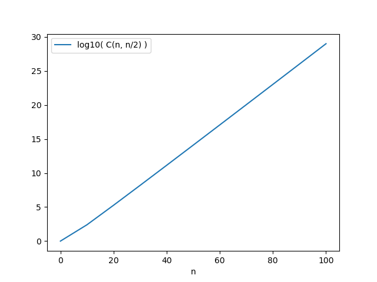

#+setupfile: ../setup.org

#+hugo_bundle: algo-basic-before-oj
#+export_file_name: index

#+title: 基础算法之写在 OJ 之前
#+date: <2021-04-07 三 18:21>
#+hugo_categories: Algorithm
#+hugo_tags: algorithm oj programing
#+hugo_custom_front_matter: :featured_image images/featured.jpg :series '("基础算法")

OJ 是学习和锻炼算法的好去处。
有很多经典的题目，考察算法的方方面面，磨练思维能力。

本文整理一些相关基础知识，用于提高思考时的严谨性。

* 语言

选择一项合适的语言是重要的。
解决问题需要算法，算法需要表达成程序，程序需要用语言编写。

推荐使用 C++。
C++ 接近底层，
方便估计数据结构的空间消耗，以及程序运行的时间效率。
虽然 Python 和 Java 都是优秀的语言，
但都存在 vm 层，
而且很多高阶数据结构和方法的实现对使用者是不透明的，
不利于估计程序的空间消耗与时间效率。

* 复杂度

** 大 O
  
算法的时间效率与空间效率用复杂度来衡量。
对于简化版的算法分析，通常只使用大 O 表示法。
   
常见复杂度有 =O(logN)=, =O(N)=, =O(NlogN)=, =O(N^2)=, =O(N!)= 和 =O(2^N)= 。
N 表示数据集的规模。

#+caption: 不同复杂度的增长速度

在分析问题时，不单衡量复杂度的增速，也要考虑绝对性。
时间复杂度为 =O(N!)= 的算法虽然比 =O(N)= 慢，
但如果 N 不是很大，在时间约束下也是可以完成的，
同样是可接受的算法。

** 绝对估计

   一般题目都会限定程序运行的时间/空间上限，以及相应的输入规模范围。
所以只明确复杂度还是不够的，应该代入具体的输入规模，
估计绝对值，对比是否超出了时空上限。

*** 常见数值估计

先来看一些常见公式的数值，做到心中有数。

**** 阶乘

在常见复杂度的公式中，阶乘的增速是最快的。 ~30! ~= 1e30~ ， ~300! ~= 1e600~ 。

位数随着 n 近似线性增加，这是非常可怕的。
   
  #+tblname: factor_data
  #+begin_src python :results table :exports none
  import math

  table = [
      ['n', 'log10(n!)']
  ]
  l = 0

  for i in range(1, 310, 1):
      l = l + math.log10(i)

      if i % 10 == 0:
          table.append([i, l])

  return table
  #+end_src

  #+RESULTS: factor_data
  |   n |          log10(n!) |
  |  10 |  6.559763032876794 |
  |  20 | 18.386124616877716 |
  |  30 |  32.42366007492572 |
  |  40 |  47.91164506815586 |
  |  50 |  64.48307487247203 |
  |  60 |  81.92017484939018 |
  |  70 | 100.07840503567996 |
  |  80 | 118.85472772249958 |
  |  90 | 138.17193579001076 |
  | 100 | 157.97000365471575 |
  | 110 |    178.20091764487 |
  | 120 | 198.82539384721971 |
  | 130 | 219.81069315614812 |
  | 140 |  241.1291099886968 |
  | 150 | 262.75689341092607 |
  | 160 |  284.6734562406829 |
  | 170 | 306.86078199482836 |
  | 180 |  329.3029714247937 |
  | 190 |  351.9858898339352 |
  | 200 |  374.8968886400403 |
  | 210 | 398.02458261493604 |
  | 220 | 421.35866954213236 |
  | 230 |  444.8897826514602 |
  | 240 |  468.6093687056476 |
  | 250 | 492.50958639546144 |
  | 260 |  516.5832209826121 |
  | 270 |  540.8236120667523 |
  | 280 |  565.2245920470159 |
  | 290 |   589.780433369098 |
  | 300 |  614.4858030437733 |

  #+begin_src gnuplot :var data=factor_data :file images/factor.png
  reset

  set xlabel "n"
  set xrange [0:310]
  set xtics 0,30,310

  set yrange [0:620]
  set ytics 0,30,620

  plot data using 1:2 w lp title "log_{10}(n!)"
  #+end_src

  #+RESULTS:
  

**** 2 的幂

2 的幂对应的位数随 n 线性增长，斜率为 ~log10(2) ~= 0.3~ 。即
- ~2^8 = 1e2.4~
- ~2^32 = 1e9.6~
- ~2^64 = 1e19.2~

  #+tblname: power_2_data
  #+begin_src python :results table :exports none
  import math

  table = [['p', 'log_{10}( power(p, 2) )']]

  for i in range(0, 64+1, 8):
      table.append([i, math.log10(pow(2, i))])

  return table
  #+end_src

  #+RESULTS: power_2_data
  |  p | log10( power(p, 2) ) |
  |  0 |                  0.0 |
  |  8 |   2.4082399653118496 |
  | 16 |    4.816479930623699 |
  | 24 |    7.224719895935548 |
  | 32 |    9.632959861247398 |
  | 40 |   12.041199826559248 |
  | 48 |   14.449439791871097 |
  | 56 |   16.857679757182947 |
  | 64 |   19.265919722494797 |

  #+begin_src gnuplot :var data=power_2_data :file images/power_2.png
  reset

  set xlabel "n"
  set xrange [0:72]
  set xtics 0,8,72

  set yrange [0:21]
  set ytics 0,2,21

  plot data using 1:2 w lp title "log_{10}(2^n)"
  #+end_src

  #+RESULTS:
  [[file:images/power_2.png]]

**** 组合数

排列数对应阶乘，组合数则和 2 的幂有关。

=C(n, k)= 随 k 的增加先增大后减小，~k = n/2~ 时，组合数是最大的。

=C(n, n/2)= 的趋势和 2 的幂是相近的，因为 ~sum_k(C(n, k)) = 2^n~ 。

  #+tblname: comb_data
  #+begin_src python :results table :exports none
  import math

  table = [
      ['n', 'log10( C(n, n/2) )']
  ]
  l = 0

  for i in range(0, 110, 10):
      table.append([i, math.log10(math.comb(i, i // 2))])

  return table
  #+end_src

  #+RESULTS: comb_data
  |   n | log10( C(n, n/2) ) |
  |   0 |                0.0 |
  |  10 |  2.401400540781544 |
  |  20 |  5.266598551124127 |
  |  30 |   8.19066085267892 |
  |  40 |  11.13939583440044 |
  |  50 | 14.101783514801882 |
  |  60 |  17.07285469953875 |
  |  70 | 20.049939738979344 |
  |  80 | 23.031437586187852 |
  |  90 | 26.016312067781552 |
  | 100 | 29.003853909771717 |

  #+begin_src gnuplot :var data=comb_data :file images/comb.png
  reset

  set xlabel "n"
  set xrange [0:110]
  set xtics 0,10,110

  set yrange [0:30]
  set ytics 0,2,30

  plot data using 1:2 w lp title "log_{10}(C(n, n/2))"
  #+end_src

  #+RESULTS:
  

**** TODO 对数

**** TODO Nlog(N)
**** TODO 浮点数的精确位

  float

  double
   
*** 时间估计

    程序运行时间大致可分成 cpu 时间和 io 时间。

**** cpu 时间

  对于单线程程序， ~cpu 运行时间 = cpu 周期时间 * 每个指令的周期数 * 运行指令数~ [fn:1]。

  cpu 的重要参数为主频，周期时间是主频的倒数[fn:2]。
  如 =Intel(R) Core(TM) i7-3840QM CPU @ 2.80GHz= ，周期时间为 ~1/2.8G s~ 。

  不同的指令需要不同的周期数，如乘法指令比加法指令消耗更多周期。

  运行指令数是由程序生成的指令与数据规模共同决定的。

  #+begin_src cpp :exports both
  #include <ctime>
  #include <iostream>

  using namespace std; 

  int main()
  {
      clock_t start,end;
      start = clock();
    
      for(int i = 0; i < 1e9; i++)
      {
        i++;
      }

      end = clock();

      cout << "running time: " << (float)(end-start)*1000.0/CLOCKS_PER_SEC << "ms" << endl;
  }
  #+end_src

  #+RESULTS:
  : running time: 1680.71ms
  
=2.8Ghz= 的 cpu 运行 =1G= 条基础指令，大约消耗时间 ~1.68s~ 。

OJ 平台的运行机器参数是不透明的，粗略用 ~1G~ 指令对应 ~1.5s~ 时间来估计即可。

**** io 时间

多数题目中，io 时间不是考察的重点，可以忽略。
但是某些情况下，大数据量加上不当的 io 操作可能超时。

因为默认设定下，scanf 和 cin 的速度是不同的[fn:3]，
scanf 比 cin 要快 10 倍（粗略估计）。
当遇到由 io 引起的超时，可以尝试修改 io 方法来减少运行时间。

*** 空间估计
  
程序运行过程中，所有需要的空间都放在内存中。
内存的最小单位为字节(1 byte = 8 bits)，4G 内存就是 ~4*1024*1024*1024~ bytes 。

在 C++ 中，类型直接对应空间，可用 ~sizeof~ 计算相应类型的变量占用的字节数。

  #+begin_src cpp :exports both :results output
  #include <cstdio>

  int main(void) {
    printf("bytes of char = %d\n", sizeof(char));
    printf("bytes of bool = %d\n", sizeof(bool));
    printf("bytes of short = %d\n", sizeof(short));
    printf("bytes of int = %d\n", sizeof(int));
    printf("bytes of long = %d\n", sizeof(long));
    printf("bytes of long long = %d\n", sizeof(long long));
    printf("bytes of float = %d\n", sizeof(float));
    printf("bytes of double = %d\n", sizeof(double));
    printf("bytes of void* = %d\n", sizeof(void*));

    printf("bytes of int[1000] = %d\n", sizeof(int[1000]));
  }
  #+end_src

  #+RESULTS:
  #+begin_example
  bytes of char = 1
  bytes of bool = 1
  bytes of short = 2
  bytes of int = 4
  bytes of long = 8
  bytes of long long = 8
  bytes of float = 4
  bytes of double = 8
  bytes of void* = 8
  bytes of int[1000] = 4000
  #+end_example

空间的计算方式是非常直白的。
单个变量对应固定大小的空间；
对于数组而言， ~数组空间 = 类型大小 * 数组长度~ 。
- ~int[1000]~ 占用空间 4K bytes
- ~int[1000 000]~ 占用空间 4M bytes
- ~int[1000 000 000]~ 占用空间 4G bytes

* 解题过程

  某种意义上，解题就是匹配模型的过程。
算法就是你分析过的模型，
如果一个问题，
可以抽象成树，尝试用递归的方法来解决；
可以抽象为 DAG，尝试用图论的相关算法来解决。
算法学习，核心就是抽象建模的能力，以及匹配模型的能力。

在遇到问题时，为自己设定一个思考框架，
可以在编码前，全面的考虑问题，减少思维的漏洞。

以下是我常用的思考框架，

1. 问题
   - 明确问题细节
   - 抽象问题模型
2. 算法
   - 提出解题过程
3. 时间估计
   - 时间复杂度
   - 最大计算周期
4. 空间估计
   - 空间复杂度
   - 最大空间占用
5. 溢出
   - 数字溢出？
   - 递归栈溢出？
6. 边界
   - 案例情况
   - 最简单情况
   - 最大边界情况

* 如何调试

很多题目都不会一次 AC，常见的错误有[fn:4]
- PE，Presentation Error，输出不合规范
- TLE，Time Limit Exceed，超时
- MLE，Memory Limit Exceed，内存超限
- WA，Wrong Anwser，错误

** PE

这是一个好信号，说明你离 AC 非常接近，只需要调整一点点格式。

多数时候是空行的问题，比如以下两种表述是不同的（常见于 UVA）。

#+begin_example
there is a blank line after each test case
vs
there is a blank line between each test case
#+end_example

前者在每个输出之 *后* 都有空行；
后者在每个输出之 *中* 才有空行。
差别就是前者比后者在最后一行多了空行。

** TLE

多数情况下，是程序的复杂度过高，无法在规定时间内解决大规模问题，
这意味着需要改进算法。

另外，死循环也是一种可能。

** MLE

MLE 是相对少见的，因为空间估计比时间估计更为准确。

实在无法减少，可以尝试用时间换空间。

** WA

WA 是最常见的。说明程序不完全正确，存在思维漏洞。

出错就要调试，可以使用多种方式
- printf 打印变量，是否符合预期
- gdb 调试
- 寻找数据集，比如针对 UVA 的 [[https://www.udebug.com/][uDebug]]

* License

#+begin_export markdown

#+end_export

* Footnotes
  
[fn:1]: https://blog.csdn.net/qq_30763385/article/details/104580790

[fn:2]: https://zhuanlan.zhihu.com/p/90829922

[fn:3]: https://blog.csdn.net/yujuan_Mao/article/details/8119529

[fn:4]: https://blog.csdn.net/weixin_43719765/article/details/84633771
