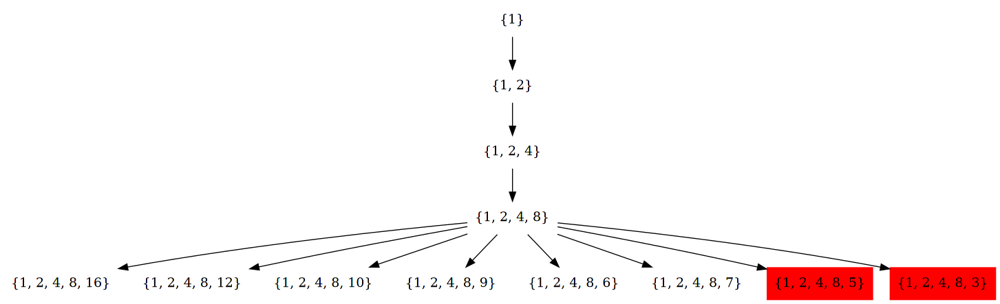

#+setupfile: ../setup.org

#+hugo_bundle: algo-uva-529-1374
#+export_file_name: index

#+title: 基础算法之 UVA 529 1374 题解
#+date: <2021-04-22 四 13:27>
#+hugo_categories: Algorithm
#+hugo_tags: algorithm oj programing
#+hugo_draft: true
#+hugo_custom_front_matter: :featured_image images/featured.png :series '("基础算法")

uva 529 和 1374 两道题目比较相似，都是考察 迭代加深搜索 的题目。

但是网上诸多题解给出了解答方式，却没有回答为什么可以这样搜索，
本文旨在给出一种证明，回答这个问题。

* UVA 1374

#+caption: uva 1374 题目描述
[[file:images/uva1374.png]]

题意很简单，从 =x^1= 开始，通过 =* /= 运算，最快到达 =x^n= 的步数。

幂的乘除就是指数的加减。将可达到的指数看作一个集合，
整体生成过程如下图所示，

#+begin_src dot :file images/1374-bfs.png
digraph {
  node[shape=none];

  s0[label="{1}"];
  s1[label="{1, 2}"];
  s21[label="{1, 2, 4}"];
  s22[label="{1, 2, 3}"];
  s31[label="{1, 2, 4, 8}"];
  s32[label="{1, 2, 4, 6}"];
  s33[label="{1, 2, 4, 5}"];
  s34[label="{1, 2, 4, 3}"];

  s35[label="{1, 2, 3, 6}"];
  s36[label="{1, 2, 3, 5}"];
  s37[label="{1, 2, 3, 4}"];

  s0 -> s1;

  s1 -> s21;
  s1 -> s22;

  s21 -> s31;
  s21 -> s32;
  s21 -> s33;
  s21 -> s34;

  s22 -> s35;
  s22 -> s36;
  s22 -> s37;
}
#+end_src

#+RESULTS:
[[file:images/1374-bfs.png]]

BFS 层序遍历显然可以解决问题，
但是随着步数的增加，状态变得越来越多。

这种情况下，迭代加深搜索是一个不错的选择。
每次选定一个搜索深度，使用 DFS 从起始状态开始搜索。

奇特的是，即使使用这个思路，对于一些数，计算时间非常的长，会 TLE。

网上诸多[[https://www.luogu.com.cn/blog/Doveqise/uva1374-kuai-su-mi-ji-suan-power-calculus-ti-xie][博客]]给出的答案也是同样的思路，不过有一些小小的区别，
即每次 DFS 时，只使用上一步生成的数和剩下的数相加减，生成新状态，
而不用全部数之间相加减来生成新状态。

举例来说，当搜索到 ={1, 2, 4, 8}= 时，
下一步有 8 种可能的状态，但是上一步生成的数字是 8，
用 8 和剩下的数，只能生成前 6 种状态，
后 2 种状态无法生成，故不用遍历。

#+begin_src dot :file images/1374-bfs-last-num.png
digraph {
  node[shape=none];

  s0[label="{1}"];
  s1[label="{1, 2}"];
  s21[label="{1, 2, 4}"];
  s31[label="{1, 2, 4, 8}"];

  s41[label="{1, 2, 4, 8, 16}"];
  s42[label="{1, 2, 4, 8, 12}"];
  s43[label="{1, 2, 4, 8, 10}"];
  s44[label="{1, 2, 4, 8, 9}"];
  s45[label="{1, 2, 4, 8, 6}"];
  s46[label="{1, 2, 4, 8, 7}"];
  s47[label="{1, 2, 4, 8, 5}", color="red", style=filled];
  s48[label="{1, 2, 4, 8, 3}", color="red", style=filled];

  s0 -> s1;

  s1 -> s21;

  s21 -> s31;

  s31 -> s41;
  s31 -> s42;
  s31 -> s43;
  s31 -> s44;
  s31 -> s45;
  s31 -> s46;
  s31 -> s47;
  s31 -> s48;
}
#+end_src

#+RESULTS:

那么问题来了，为什么这种搜索方式是正确的？
网络博客都没有给出相应的证明，甚至在紫书上，也只是附上一句，
“限于水平，笔者无法证明这个猜想，但是 1000 以内没有找到反例”。

* UVA 529

#+caption: uva 529 题目描述
[[file:images/uva529.png]]

题意很简单，从 1 开始，递增的序列，如何最短的增长到 n 。

