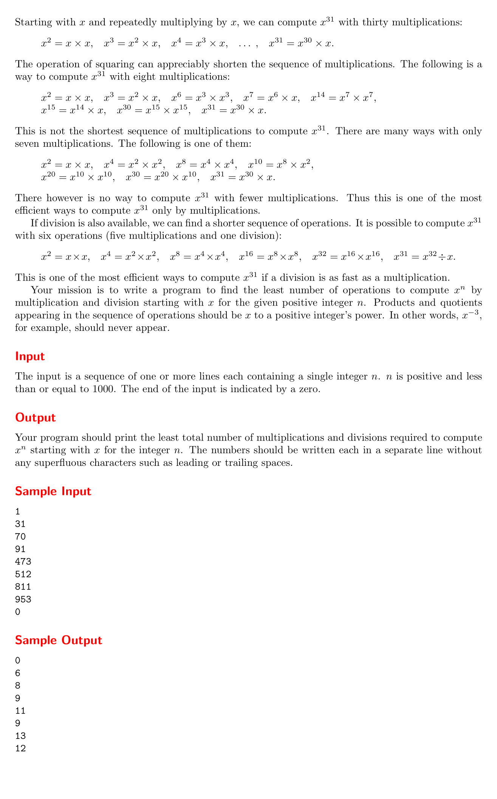
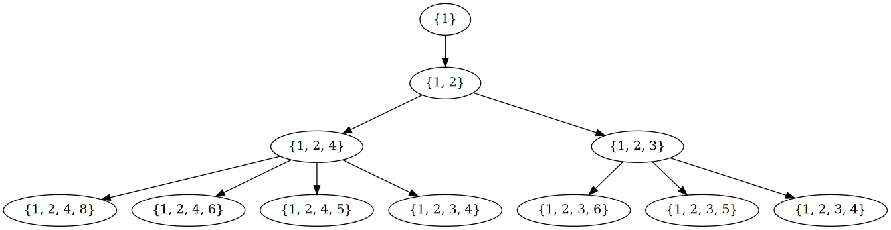
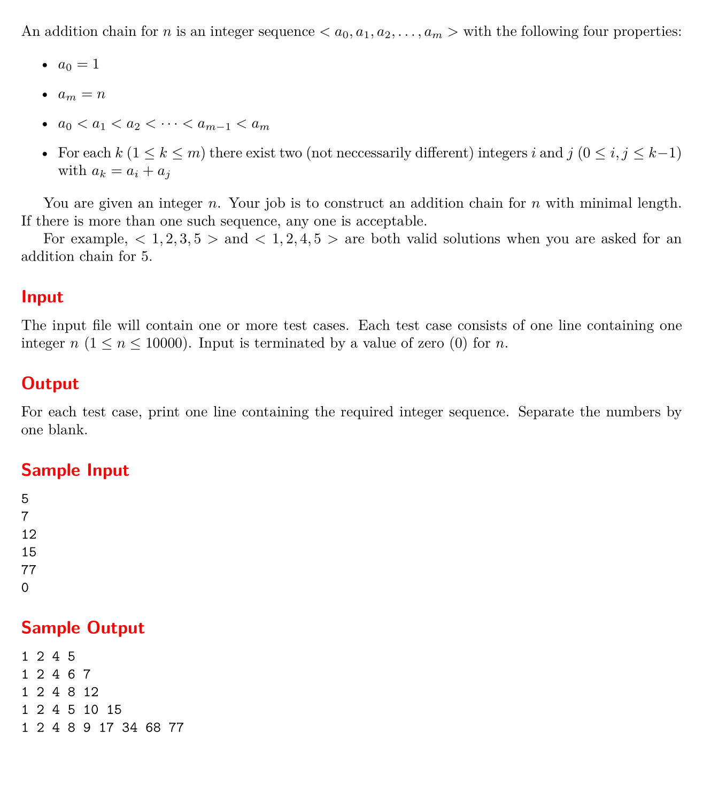

#+setupfile: ../setup.org

#+hugo_bundle: algo-uva-529-1374
#+export_file_name: index

#+title: 基础算法之 UVA 529 1374 题解
#+date: <2021-04-22 四 13:27>
#+hugo_categories: Algorithm
#+hugo_tags: algorithm oj programing
#+hugo_draft: true
#+hugo_custom_front_matter: :featured_image images/featured.png :series '("基础算法")

uva 529 和 1374 两道题目比较相似，都是考察 迭代加深搜索 的题目。

但是网上诸多题解给出了解答方式，却没有回答为什么可以这样搜索，
本文旨在给出一种证明，回答这个问题。

* UVA 1374

#+caption: uva 1374 题目描述

题意很简单，从 =x^1= 开始，通过 =* /= 运算，最快到达 =x^n= 的步数。

幂的乘除就是指数的加减。

将可达到的幂看作一个集合，

#+begin_src dot :file images/1374-bfs.png
digraph {
  s0[label="{1}"];
  s1[label="{1, 2}"];
  s21[label="{1, 2, 4}"];
  s22[label="{1, 2, 3}"];
  s31[label="{1, 2, 4, 8}"];
  s32[label="{1, 2, 4, 6}"];
  s33[label="{1, 2, 4, 5}"];
  s34[label="{1, 2, 3, 4}"];
  s35[label="{1, 2, 3, 6}"];
  s36[label="{1, 2, 3, 5}"];
  s37[label="{1, 2, 3, 4}"];

  s0 -> s1;

  s1 -> s21;
  s1 -> s22;

  s21 -> s31;
  s21 -> s32;
  s21 -> s33;
  s21 -> s34;

  s22 -> s35;
  s22 -> s36;
  s22 -> s37;
}
#+end_src

#+RESULTS:

BFS 显然可以解决问题，但是状态太多，并且状态也不易存储，
这种情况下，迭代加深搜索是一个不错的选择。

https://www.luogu.com.cn/blog/Doveqise/uva1374-kuai-su-mi-ji-suan-power-calculus-ti-xie

  - 选择最近生成的数？
    - 原因

* UVA 529

#+caption: uva 529 题目描述

题意很简单，从 1 开始，递增的序列，如何最短的增长到 n 。

