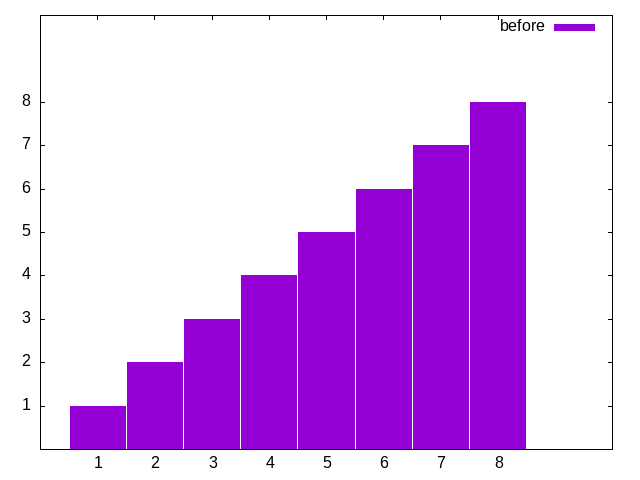
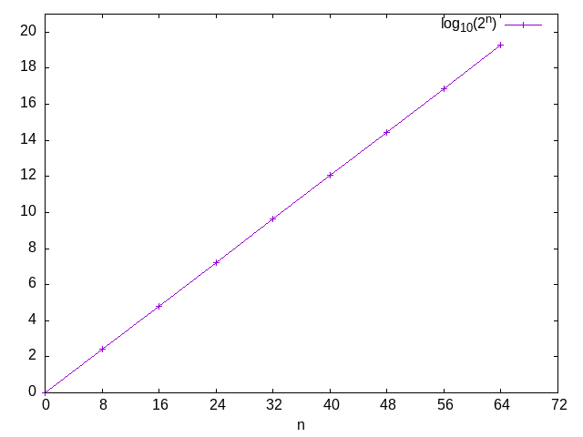
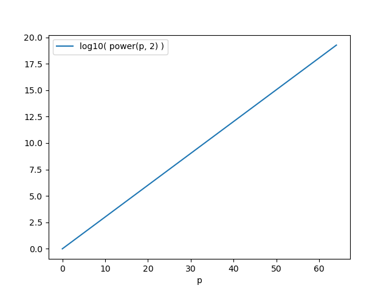

#+setupfile: ../setup.org

#+hugo_bundle: gnuplot-example
#+export_file_name: index

#+title: gnuplot example
#+date: <2021-03-29 一 15:36>
#+hugo_categories: Tool
#+hugo_tags: tool gnuplot drawing
#+hugo_draft: true
#+hugo_custom_front_matter: :comment false :featured_image images/featured.jpg

#+tblname: dict_order_n_table
| 0 | 0 |
| 1 | 1 |
| 2 | 2 |
| 3 | 3 |
| 4 | 4 |
| 5 | 5 |
| 6 | 6 |
| 7 | 8 |
| 8 | 7 |

#+begin_src gnuplot :var data=dict_order_n_table :file images/dict_order_n_table.png
set xrange [0:10]
set xtics 1,1,8

set yrange [0:10]
set ytics 1,1,8

set boxwidth 2.9 relative

set style fill solid
plot data u 1 w histograms title "before"
#+end_src

#+RESULTS:

#+tblname: power_2_data
|  p | log10( power(p, 2) ) |
|  0 |                  0.0 |
|  8 |   2.4082399653118496 |
| 16 |    4.816479930623699 |
| 24 |    7.224719895935548 |
| 32 |    9.632959861247398 |
| 40 |   12.041199826559248 |
| 48 |   14.449439791871097 |
| 56 |   16.857679757182947 |
| 64 |   19.265919722494797 |

#+name: gplot
#+header: :var data=power_2_data
#+begin_src gnuplot :file images/power_2.png
set xlabel "n"
set xrange [0:72]
set xtics 0,8,72

set yrange [0:21]
set ytics 0,2,21

plot data using 1:2 w lp title "log_{10}(2^n)"
#+end_src

#+RESULTS:
[[file:images/power_2.png]]

#+call: gplot(data=power_2_data) :file images/p_2_t.png

#+RESULTS:

#+name: plot
#+header: :var data=factor_data :var filename="images/factor.png"
#+begin_src python :results file :exports results
import matplotlib
import matplotlib.pyplot as plt
matplotlib.use('Agg')
import numpy as np
import pandas as pd

fig = plt.figure(figsize=(4,2))
fig.tight_layout()

df = pd.DataFrame(data[1:], columns=data[0])
df.plot(x=data[0][0])

fname = filename
plt.savefig(fname)
return fname
#+end_src

#+RESULTS: plot

#+call: plot(data=power_2_data, filename="images/py_power_2.png")

#+RESULTS:

