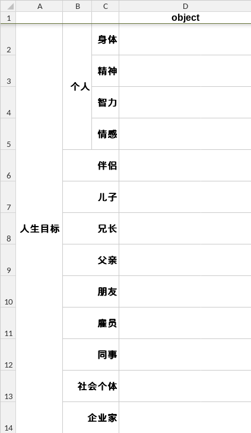
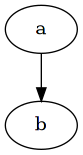

#+setupfile: ../setup.org

#+hugo_bundle: goal-practice
#+export_file_name: index

#+title: 自我管理实践
#+date:<2021-05-25 二 09:20>
#+hugo_categories: Theory
#+hugo_tags: life mind goal theory
#+hugo_draft: true
#+hugo_custom_front_matter: :comment false :featured_image images/featured.jpg :series '(test)

在 [[/post/goal-theory/][论自我管理]] 一文中，谈到了自我总结的一种理论，
用于在工作，生活中做自我管理。

理论的核心是简单的，
将目标从上到下的分解为事项，可以保持日常行为与目标的一致；
执行结果从下到上的反馈，时刻更新自我的成长。
自我评估，设立目标，计划事项，执行事项，总结反思，
这五项行为前后连接，不断循环反复。

本文侧重于，自己如何将理论运用于实践中。

* 自我评估

认识自己是困难的。毕竟人本身就是复杂的，并不纯粹。

我觉得随性写作是一种认知自己的强大工具，
无论有什么想法，写下来；
有什么回忆，写下来。
写作将抽象的内心实体化到纸面上，
放到灯光下来审视。
这篇 [[/post/self-cognition-history][自我认知变化史]] 就是尝试用写作回忆自己的历史，
将当前的自我完全吐露出来。
得以明确自己对人对事的态度，自己的价值观。

评估的另一点是明确自己的资产情况。
受《高效能人士的七个习惯》的启发，
从不同的身份维度，分别讨论，会对自我的当前状态有更清晰的认识。

| 维度     | 子维度 | 状态 |
|----------+--------+------|
| 个人     | 身体   |      |
| 个人     | 精神   |      |
| 个人     | 智力   |      |
| 个人     | 情感   |      |
| 伴侣     |        |      |
| 儿子     |        |      |
| 兄长     |        |      |
| 父亲     |        |      |
| 朋友     |        |      |
| 雇员     |        |      |
| 同事     |        |      |
| 社会个体 |        |      |
| 企业家   |        |      |

* 设立目标

#+begin_quote
Give life a purpose.
#+end_quote

每个人都有自己的目标，
无论是显性的还是隐性的。
在明确自身的价值观之后，
自己目标会更加明确。

书写人生的总目标不是一件容易的事，
因为它太远了，看起来太困难了，
以至于难以区分是梦想还是幻想。

我的建议是，依旧按照身份的维度来拆分，
每个维度下，列下一个最重要的，想达成的目标。
最好不同身份之间的目标有协同效应，不至于太分散。
推荐使用表格软件，将目标明确记录下来。

* 计划事项

- 目标只是一个点
  能不能到达 怎么到达 用什么到达 需要计划

#+begin_src dot :file images/struct.png
digraph {
	a -> b;
	}
#+end_src

#+RESULTS:

- 目标拆分
  - 5 年计划拆分
  - 1 年计划拆分
  - 月度
  - 星期
  - 天
  - 状态点

- 大目标明确
  - 每天要做的事，要和更大的目标关联起来
- 做每一件事情，都要反向追溯，为什么要做
  todo 关联到目标，小目标关联到大目标

- 目标很宏大，但是还是需要每天的积累来完成
- 目标量化
  - 从模糊到精确
  - 目标分解
  - 消耗时长
- 时间的理解
  - 当时间分片
  - 一件事，付出精力来完成
  - 精力 = 时间 * 效率
  - 时间是事情消耗的计量
  - 总量 和 先后

* 执行事项

- 执行
  - 每日记录，总结
  - 一周内，每日记录
  - 半小时时间片
  - 调整其它，交换时间片
  - 一周内子计划的调整
  - 时间片的调整

- 总结
  - 量化
    - 总结进度
    - 对比计划
  - 当天符合计划的
  - 未执行的
  - 交换时间的
  - 未执行计划的
  - 提前执行的

* 反思回顾

- 过去的 归入存档
  - 向上汇总周计划
  - 向上汇总月计划

- 反思，修正
  - 重新评估自我
  - 是否修改目标
  - 有更好的计划方式

