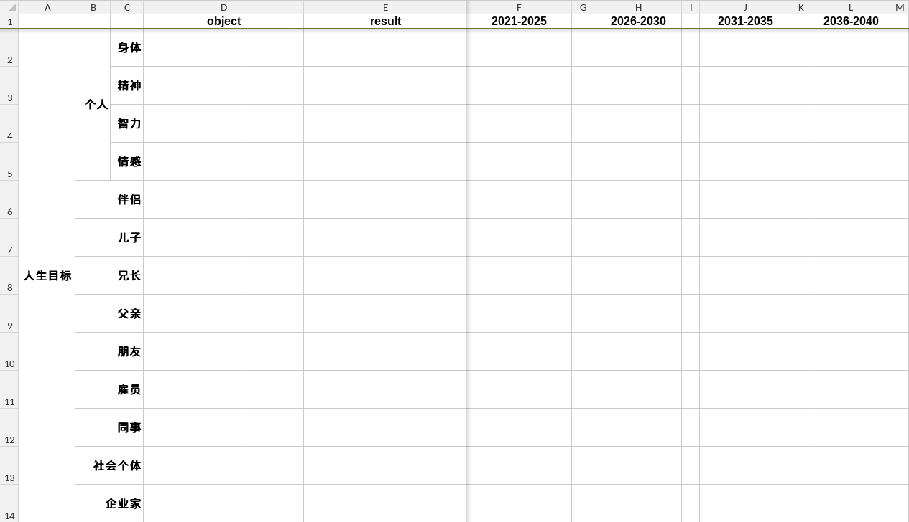
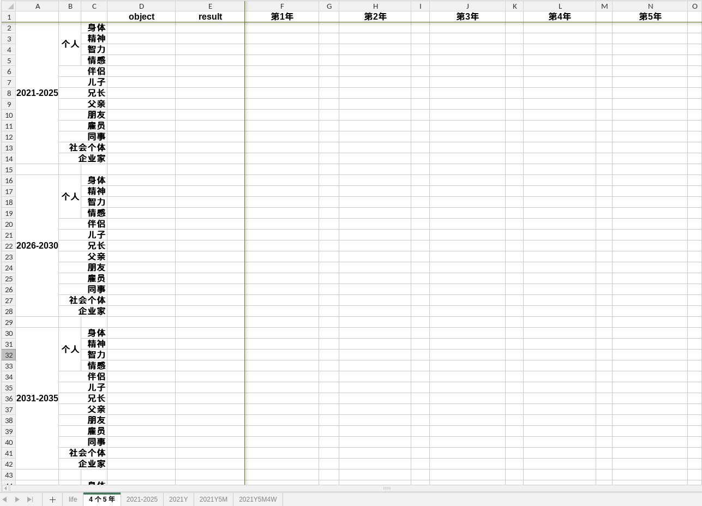
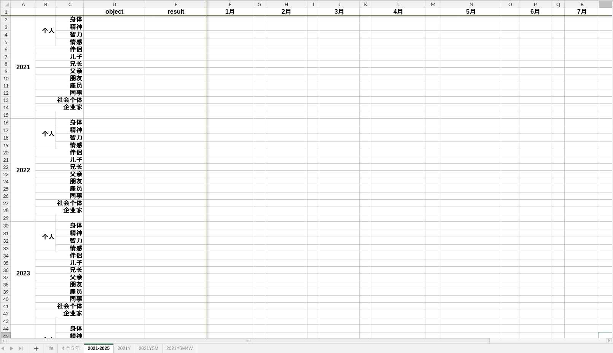
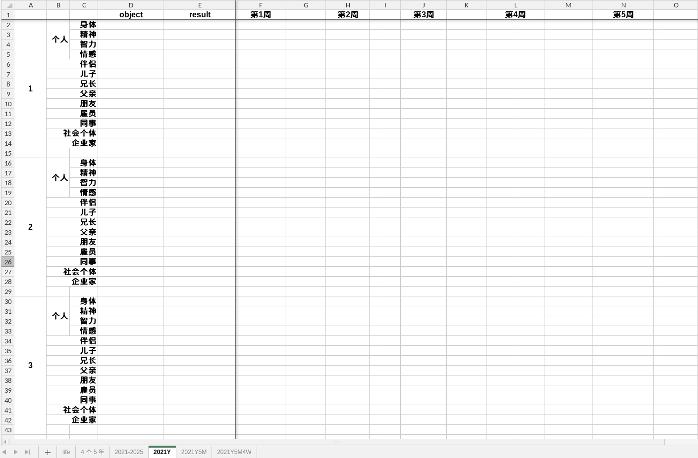
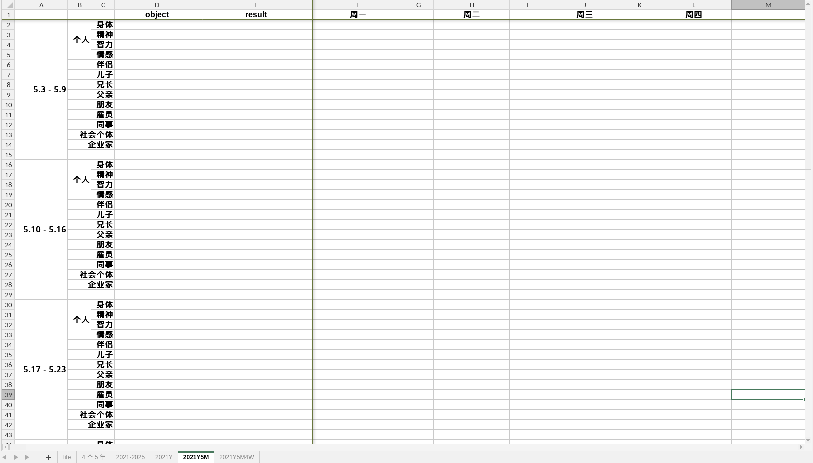
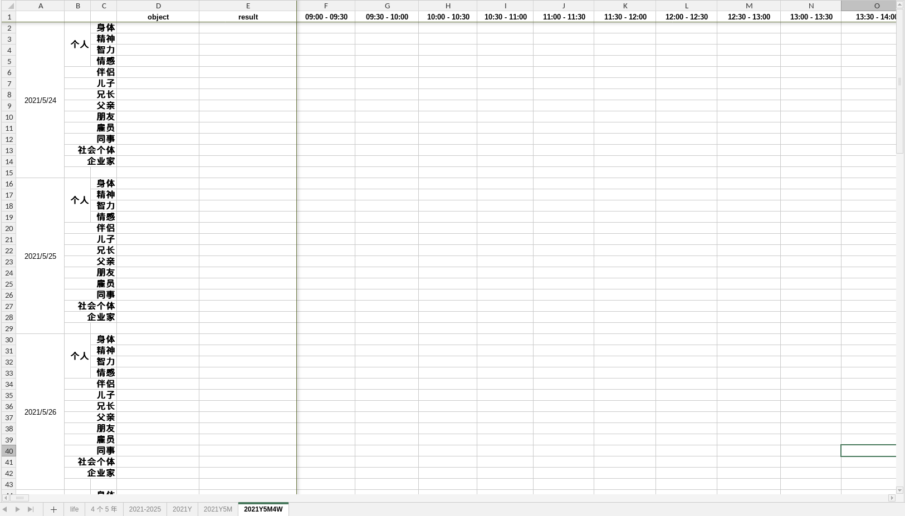
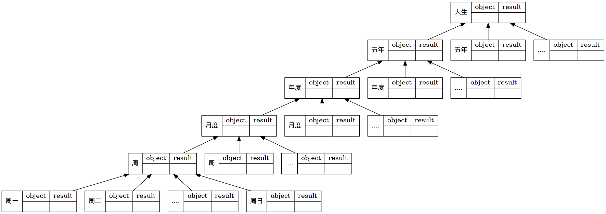

#+setupfile: ../setup.org

#+hugo_bundle: goal-practice
#+export_file_name: index

#+title: 自我管理实践
#+date:<2021-05-25 二 09:20>
#+hugo_categories: Theory
#+hugo_tags: life mind goal theory
#+hugo_custom_front_matter: :featured_image images/featured.jpg

在 [[/post/goal-theory/][论自我管理]] 一文中，谈到了自我总结的一种理论，
用于在工作，生活中做自我管理。

理论的核心是简单的，
将目标从上到下的分解为事项，可以保持日常行为与目标的一致；
执行结果从下到上的反馈，时刻更新自我的成长。
自我评估，设立目标，计划事项，执行事项，总结反思，
这五项行为前后连接，不断循环反复。

本文侧重于，自己如何将理论运用于实践中。

* 自我评估

认识自己是困难的。毕竟人本身就是复杂的，并不纯粹。

我觉得随性写作是一种认知自己的强大工具，
无论有什么想法，写下来；
有什么回忆，写下来。
写作将抽象的内心实体化到纸面上，
放到灯光下来审视。
这篇 [[/post/self-cognition-history][自我认知变化史]] 就是尝试用写作回忆自己的历史，
将当前的自我完全吐露出来。
得以明确自己对人对事的态度，自己的价值观。

评估的另一点是明确自己的资产情况。
受《高效能人士的七个习惯》的启发，
从不同的身份维度，分别讨论，会对自我的当前状态有更清晰的认识。

| 维度     | 子维度 | 状态 |
|----------+--------+------|
| 个人     | 身体   |      |
| 个人     | 精神   |      |
| 个人     | 智力   |      |
| 个人     | 情感   |      |
| 伴侣     |        |      |
| 儿子     |        |      |
| 兄长     |        |      |
| 父亲     |        |      |
| 朋友     |        |      |
| 雇员     |        |      |
| 同事     |        |      |
| 社会个体 |        |      |
| 企业家   |        |      |

* 设立目标

#+begin_quote
Give life a purpose.
#+end_quote

每个人都有自己的目标，
无论是显性的还是隐性的。
在明确自身的价值观之后，
自己目标会更加明确。

书写人生的总目标不是一件容易的事，
因为它太远了，看起来太困难了，
以至于难以区分是梦想还是幻想。

我的建议是，依旧按照身份的维度来拆分，
每个维度下，列下一个最重要的，想达成的目标。
最好不同身份之间的目标有协同效应，不至于太分散。
推荐使用表格软件，将目标分维度记录下来。

[[file:images/life.png]]

* 计划事项

目标只是一个点，怎样到达那里，需要明确地计划。

目标拆分是非常重要的一步，将人生总目标逐次向下拆分为
- 5 年目标
- 1 年目标
- 月度目标
- 周度目标
- 天目标

#+begin_src dot :file images/struct.png
digraph {
	life[shape=record,label="人生 | { object | } | { result | }"];

	year5_1[shape=record,label="五年 | { object | } | { result | }"];
	year5_2[shape=record,label="五年 | { object | } | { result | }"];
	year5_3[shape=record,label=".... | { object | } | { result | }"];

	year1[shape=record,label="年度 | { object | } | { result | }"];
	year2[shape=record,label="年度 | { object | } | { result | }"];
	year3[shape=record,label=".... | { object | } | { result | }"];

	month1[shape=record,label="月度 | { object | } | { result | }"];
	month2[shape=record,label="月度 | { object | } | { result | }"];
	month3[shape=record,label=".... | { object | } | { result | }"];
	
	week1[shape=record,label="周 | { object | } | { result | }"];
	week2[shape=record,label="周 | { object | } | { result | }"];
	week3[shape=record,label=".... | { object | } | { result | }"];

	day1[shape=record,label="周一 | { object | } | { result | }"];
	day2[shape=record,label="周二 | { object | } | { result | }"];
	day3[shape=record,label=".... | { object | } | { result | }"];
	day7[shape=record,label="周日 | { object | } | { result | }"];

	life -> year5_1;
	life -> year5_2;
	life -> year5_3;

	year5_1 -> year1;
	year5_1 -> year2;
	year5_1 -> year3;

	year1 -> month1;
	year1 -> month2;
	year1 -> month3;

	month1 -> week1;
	month1 -> week2;
	month1 -> week3;

	week1 -> day1;
	week1 -> day2;
	week1 -> day3;
	week1 -> day7;
	}
#+end_src

#+caption: 目标拆分
#+RESULTS:
[[file:images/struct.png]]

每天做的事，都可以反向追溯到高层次的目标，和更大的目标关联起来，
如此做事，原因是明确的，信念是坚定的。

目标按时间来分解，让我们重新认知 时间的意义。
每一件事，都需要花费精力来完成，
粗略而言， *精力 = 时间 * 效率* ，
个人效率通常是有限度的。
综合下来，时间是事情消耗的计量。

宏大的目标，终归要每天花费时间，慢慢积累来达成。

同样地，我也使用表格软件来完成这个过程。

#+caption: 人生目标 分解 5 年目标

#+caption: 5 年目标 分解 1 年目标

#+caption: 1 年目标 分解 月度目标

#+caption: 月度目标 分解 周度目标

#+caption: 周度目标 分解 天目标

* 执行事项

执行，就是将每天的目标，安排到一天的 24 小时中来完成。

我倾向于将时间分成半小时的时间片，
每个时间片上处理一个目标相关的事项。

在一天的开始，先做计划，
将当日目标涉及的事项安排到所有时间片上。

随着执行的过程，对每个时间片处理的事项做记录。
执行的过程，随时可能发生意外，
打断原本的计划，这时需要灵活的应对，交换时间片上事项的先后顺序。

在一天的结束，做当日总结，统计到 result 中，
- 对于不同目标的估计用时是否准确
- 哪些目标完成，哪些没有完成
- 对周度计划的影响

#+caption: 天目标 分解 时间片

* 回顾反思

上面都是从上至下的过程，反思回顾是从下至上的过程。

在执行过程中，每天都会做相应记录和总结。
一周七天过去后，将每天的总结再总结起来，作为周度总结。
由此往上，形成月度总结，年度总结，5 年总结，人生总结。

总结是执行的结果，和原定的目标必定会有差异。
回顾过去，思考形成差异的原因，同时归纳经验，从新的角度来审视整个过程。
- 重新评估自我
- 目标是否发生改变
- 是否有更好的计划

#+begin_src dot :file images/whole.png
digraph {
	life[shape=record,label="人生 | { <o> object | <oc> } | { <r> result | <rc> }"];

	year5_1[shape=record,label="五年 | { <o> object | <oc> } | { <r> result | <rc> }"];
	year5_2[shape=record,label="五年 | { <o> object | <oc> } | { <r> result | <rc> }"];
	year5_3[shape=record,label=".... | { <o> object | <oc> } | { <r> result | <rc> }"];

	year1[shape=record,label="年度 | { <o> object | <oc> } | { <r> result | <rc> }"];
	year2[shape=record,label="年度 | { <o> object | <oc> } | { <r> result | <rc> }"];
	year3[shape=record,label=".... | { <o> object | <oc> } | { <r> result | <rc> }"];

	month1[shape=record,label="月度 | { <o> object | <oc> } | { <r> result | <rc> }"];
	month2[shape=record,label="月度 | { <o> object | <oc> } | { <r> result | <rc> }"];
	month3[shape=record,label=".... | { <o> object | <oc> } | { <r> result | <rc> }"];
	
	week1[shape=record,label="周 | { <o> object | <oc> } | { <r> result | <rc> }"];
	week2[shape=record,label="周 | { <o> object | <oc> } | { <r> result | <rc> }"];
	week3[shape=record,label=".... | { <o> object | <oc> } | { <r> result | <rc> }"];

	day1[shape=record,label="周一 | { <o> object | <oc> } | { <r> result | <rc> }"];
	day2[shape=record,label="周二 | { <o> object | <oc> } | { <r> result | <rc> }"];
	day3[shape=record,label=".... | { <o> object | <oc> } | { <r> result | <rc> }"];
	day7[shape=record,label="周日 | { <o> object | <oc> } | { <r> result | <rc> }"];

	life -> year5_1[dir="back"];
	life -> year5_2[dir="back"];
	life -> year5_3[dir="back"];

	year5_1 -> year1[dir="back"];
	year5_1 -> year2[dir="back"];
	year5_1 -> year3[dir="back"];

	year1 -> month1[dir="back"];
	year1 -> month2[dir="back"];
	year1 -> month3[dir="back"];

	month1 -> week1[dir="back"];
	month1 -> week2[dir="back"];
	month1 -> week3[dir="back"];

	week1 -> day1[dir="back"];
	week1 -> day2[dir="back"];
	week1 -> day3[dir="back"];
	week1 -> day7[dir="back"];
	}
#+end_src

#+caption: 回顾反思
#+RESULTS:

* 附件

[[file:images/template.xlsx][自我管理表格模板]]

* TODO 更新
  
目标在分解过程中，
会慢慢地从模糊到精确，
从而对目标的时长消耗有明确的估计，
即一个逐渐量化的过程。

过去的 归入存档

* License

#+begin_export markdown

#+end_export

