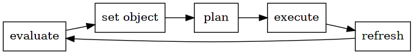
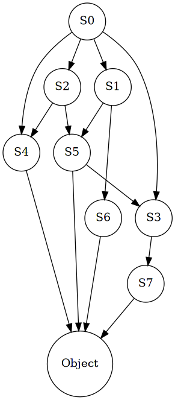

#+setupfile: ../setup.org

#+hugo_bundle: goal-theory
#+export_file_name: index

#+title: 人生理论之目标管理
#+date: <2021-03-23 二 16:05>
#+hugo_categories: Mind
#+hugo_tags: life mind goal theory
#+hugo_draft: true
#+hugo_custom_front_matter: :comment false :featured_image images/featured.jpg

如何更好地度过一生？很多人都没有答案。
漫无目的，压抑本心，这种生活方式天生是分裂的，无法长久的。
曾有多时，感觉工作时如坐针毡；
几个年末，发现自己依旧在原地；
多次在噩梦中惊醒，惶恐一生会如此平凡下去。

#+begin_quote
其实，人生需要管理。
#+end_quote

管理，意味着设立目标，跟进进度，安排时间，调度资源等等。

现实中，很多人讨厌“管理”这个词。看到它就联想到规则，束缚，压制，是冰冷的。
的确，管理是多数时候是有些“不近人情”的，像一台无情的电脑，
给出一条一条指令，应该如何做。
而正是反人情，而能催促人去做正确的事。
因为“每个人都有惰性”，管理就是尝试去改善这一点。

多数人都有放长假的经验。
短短的周末两天，可以得到放松；
而一两个月的假期，失去时间观念，无聊，乏味，觉得时间难以消磨。

现代的工作制度，法定假期的安排，就应用了这一点。
在短暂的放松，不至于失去工作状态的连续性。

关于自我管理，前人已经总结了多种方法，个人感觉多少无法完全切合自身的需求。
从 todo 管理，时间管理，到精力管理，我个人是其爱好者和使用者。
如果以软件来类比，这些不同版本的软件都有些许 feature 没有包含。
todolist 缺少对长期连续性，让人沉浸在打勾的快感中；
时间管理过于关注效率，缺少对个人成长与长期目标的关注；
精力管理更进一步，注重高质量的时间，而没有质的改进。

本文的目的在于，尝试整合所有理论的优点，根据自身经验，
提出一种“更好”的自我管理方法。
  
* 常见陷阱

人生有很多陷阱。
我曾沉陷于某些陷阱，想必也陷住了其它很多人。

方向分散。
在我还是软件专业的大一新生时，总问过学长，
在这个专业的学习过程中遇到的最大的问题是什么？
他想了想说，“这个专业的东西太多了，
东西做着做着，一不小心就会偏到别的方向去。”
之前体会不深，现在深以为然。
这也是我看到 “T型人才” 理论时为何如此震惊。
“T型人才” 理论建议一个人在一个专业方向有深度，如 T 的竖线；
同时涉猎广泛，有其它专业的广度，如 T 的横线，
结合一些新奇的想法，同自己专业的前沿，探索出一些新东西。
若以这个理论评价自己，应该是 “.型人” 。
回想自己的学习生涯，总是抱着新奇的心态，
顺从内心贪婪的冲动，不断尝试新的东西，觉得总比继续深入挖掘更好，
结果没有一个方向的深入积累，人生在多个方向的浪费中涣散了。
公司的 CEO 对我说，“积累是重要的，要在某个方向有所积累”。
毕竟一个人时间有限，精力有限，不可能是全部，做到全部，
所有事情都做满，能在一个方向，一个点，已经很不错了。

时间的错觉。
时间是客观的，一小时永远是那么长，但是人的心理是变化的，
对时间有自己的感知。
就是说存在心理时间与实际时间，两种时间。
有的时候，觉得时间过得非常快，而有时度日如年，就是人的心理感知。
合理的时间观念，要逐渐顺应客观时间，是不可违背的，
而很多人如我有着非常不成熟的时间观念。
表现在，高估自己的效率，认为只需要很少的时间；
对时间抱有不切实际的幻想，认为之后一定会怎么怎么样。
从而行动拖延，消耗时间。

分裂的内心。
很多时候，会周期性地陷入迷茫的状态。
不知道自己在干什么，在做的事有什么意义，
未来会走到哪里，人生的价值在哪里。
这个时候只想逃离在做的事，
想放空自己，想静心思考，给自己一个答案。
其实每个人的内心都是分裂的，
如意识和潜意识。意识只能控制人体的一部分，
无法控制如呼吸，血液循环等潜在意识的范围。
两者各有自己的主张，如何协调两者的关系，
是人生中的大问题。

* 目的地

在现在的我看来，落入陷阱的最大原因在于，
太多人不知道，自己最终要到哪里，
只是一步一步乱走一通，
随波逐流，随遇而安。

每个人都应该在生命中尽早回答这样一个问题，
自己的终点在哪里？
如何定义终点，就是如何定义你人生的意义。
这是一种以终为始的思路，
当你遇到内心冲突，
反思现实困境和与梦想目标的偏差，
始终知道自己的方向在哪里。

每个人的终点是不同的。这一点要结合自己。
多数人盲目崇拜的成功可能不是你的终点，
环境与时遇可遇不可求。
切合自己的实际，毕竟，每个人都有自己的性格，兴趣，喜好，认知。
没有人的命运是相同的。

在个人的差异上，提出一个通用的假设，

#+begin_quote
人生的意义就是价值的最大化
#+end_quote

价值，就是所谓价值认同，价值观，中的价值二字。
每个人的价值观都不同，有人热衷财富，有人追求幸福感，
有人只想环游世界，对于不同的观点，我们应该尊重不同。

遵从价值的方向才是最为充实的方向。
比如听到人说，“这么做没意义，没有价值，简直是浪费时间。”
这时他就在谈论意义和价值。
只有合乎自身价值认同的，人才会感觉到充实，
因为自己所做的，和价值方向相同的。
如果不追求价值，平凡的度过一生，很难找到自身的意义，
更糟糕的是，逆向而行，去破坏去减少价值，内心势必是痛苦的。

* 理论

在上面的基础上，提出一种理论，
如何以终点为目标，做好自我管理。

** 定义
*** Agent

 #+begin_quote
 Agent 是一个资产集合体
 #+end_quote

 Agent，概念取自 强化学习
 资产，概念来自 投资理论
 资产划分，来自高效能人士

 强化学习认为一个智能体，通过和环境交互，
 个体与环境的交互，影响环境，环境反馈，来进行学习。

 - 资产
   - 身内之物
     - 身体，自身的物质基础
     - 精神，意识所在
     - 智力，做事能力
     - 情感，共情，与其它 agent 的共鸣
   - 身外之物，所有的，可用的，如
     - 金钱
     - 人际关系
     - 权力
     - 声望

 人出生在世，生不带来任何东西，只有身内之物是与生俱来的。

 每一项资产都存在相应的属性
 - 资产是可比较的，可量化？可交换？
   - 多和少
 - 属性各不相同
 - 所有权

*** Value

 #+begin_quote
 Value 是 Agent 对不同资产的认可度
 #+end_quote

 价值是什么决定的？
 价值，与价值观同名，不是例外
 Agent 个体的主观认同。

 很少有普世的价值认同。
 和平？可能都不是
 舍生取义
 重利轻生

 一个人的精神，一个人的意识，之能称为“我”的东西，科学也没有明确的解释。

 单纯内修的人，是一种逃避现实的精神胜利
 单纯外修的人，往往失去真正的自我

 不用精神胜利法，价值，总是寄托在实体上。

 内外兼修，内圣外王的辩证关系

*** State

 #+begin_quote
 State 是 Agent 在某个时间点的资产状态
 #+end_quote
   
 Agent 在时间线上演变

 资产集合的状态变化

*** Object

 #+begin_quote
 Object 是 Agent 的目标 State
 #+end_quote

 来自 OKR 的 O 概念，设立明确的目标

   
 目标是根据价值而设立的，一个 Agent 的目标状态
 目标是具体的，可量化的

 目标在时间跨度上的分解
 在目标层面，agent 有多个方面进行分解

*** Thing

 #+begin_quote
 Thing 是两个 State 之间的连接
 #+end_quote
   
 Thing 是所谓做事
 假如什么都不做，必定停留在原地，一动不动
 事情可以改变 Agent 状态，是将不同状态连接起来

 事情本身有
 - 投入
 - 回报

 根据投资理论，
 做事必须有相应的投入，便是成本，消耗相应的资源，本身也对应着回报
 达成之后，会带来状态的改变，回报 - 投入

 当下到目标之间，就是由多个子状态连接的
 通过做事，来达到目标，慢慢向目标靠近

** 模型
   
 #+begin_src dot :file images/theory-loop.png
 digraph {
	 node[shape=rectangle];
	
     "evaluate self" -> "set object" -> "plan things" -> "execute it" -> "refresh self";
     "refresh self" -> "evaluate self"[label="loop"];
 }
 #+end_src

 #+RESULTS:
 

 1. evaluate self，评估自身，认知自我，明确资源情况，探讨自己的价值观
 2. set object，制定最大化自身价值的长期目标
 3. plan things，目标分解，为短期目标，安排事情
 4. execute it，在时间线上，执行计划，自律，执行
 5. refresh self，更新状态，总结经验
 6. loop，agent 自身状态已经发生变化，重新评估，开始这个循环，
 因为自身的改变，会使得认知，心性，目标，计划方法都发生改变，
 从而影响之后的整个蓝图，所以这一步要重新开始修正

 自身的状态与目标状态存在一些偏差，需要从头开始进行新的调整

 loop 的周期可长可短

*** evaluate self

 #+begin_quote
 认识你自己
 #+end_quote
   
 评估
 - 自我价值取向
   - 很多人并不了解自己，往往觉得在工作中，在生活中，
     某个瞬间，感觉失去了真我，和内心相背离。
   - 从一开始没有认清楚的事，被外界推着走，随波逐流
   - 认知自己要什么，对资源的评价，Value
     - Value 不适宜使用 贪心 策略走极端，各个方面有相对的 多 和 少
       不能完全没有
     - 失去了平衡的原则，是毁灭性的打击
   - 如何分析自我，如何评估自己的价值取向，适合做什么，用什么方法？
     - 喜欢和不喜欢的事
     - 羡慕和讨厌的事
     - 擅长与不擅长的事
     - 对事物的有限接触，不足以证明你没有其它的可能性
     - 接触新事物
   - 猛然醒悟
     - 这种由内而外的方法不一定准确
     - 多数时间，都是被内心的大象所牵走
     - 每次冲突，都是妥协
     - 它不是理性，只会在噩梦中横冲直撞
   - 以理性为主
     以现世为主
   - 理性 在大象和现实问题之间求生存
     - 大象需要教化
     - 现实问题需要解决
     - 理性才会成长
 - 资源状态
   - 在资源评估之后
   - 多个方面
   - 智力
   - 身家
   - 关系
  
*** set object

 #+begin_quote
 如果不知道去哪里，那么到达哪里也无所谓了。
 #+end_quote

 目标
 - 目标表示一个状态，想要到达的状态。
 - 目标由价值而来
   目标由现实的困境而来
 - 平衡的原则
   - 首先，内外兼修
     不宜完全使用贪心原则，权重大的得到全部
     因为不是评估不是线性的关系
     完全失去一方面的资产，是毁灭性的打击
 - 在生活中，不仅有自己的目标，还要实现外部的目标，比如在组织中。
   只有外部目标与自己目标有高度重合，才是最有效率的人生，
   否则目标的冲突会分割自己稀少的时间。
 - 目标固然很重要，但如果目之所及，只有目标，就错过了其它的新事物。
 - 所以在自己的目标中，应该添加关于接收新事物，新消息的目标，
   打开接收消息，主动更新的窗口。
   - RL 中概念，探索与探究的矛盾
   - 如果就一条路一直走下去，可能不是最优的，为探究
   - 同时应该探索其它方面，新鲜的，启发思路，为探索
   - 新闻
   - 其它领域

*** plan things

 #+begin_quote
 始计
 #+end_quote

 计划不是凭空而来，而是经过大量的时间
 收集资料，分析优劣，安排出来的

 计划
 - 分解目标
   将大目标分解为力之所及的小目标
 - 安排事情
   针对某个目标，寻找出成本最小的做事路径，安排时间作为 todo
   GTD
 - 组织中的目标分解，是将目标分解到同一时间的不同人身上，
   而个人的目标分解，是将目标分解到自己一生的不同时间上。
 - 每件事，都会消耗资源，如时间，金钱，能量，人脉，这就是成本部分。
   如果有人无偿帮忙，是更好，或者资源交换，雇用，这便是做事的方法。
 - 计划就是要合理的安排资源。
   最小的投入，得到最高的回报。
 - 要实现一个目标，有无数种做事的组合可达成；
   最优的计划就是成本最小的做事方式。
 - 分解的小目标必须和大目标一样，是可量化的。
   比如将 lua book 目标分解到最小，“发布 gc 章节”，看起来像是一件事情，
   也可以看作是一个 bool 属性的小目标，因为最终只能衡量 发布/未发布 两种结果。
 - 现状 到 目标的距离可以分解，
   在时间线上分解，小到力之所及

 #+begin_src dot :file images/overview.png
   digraph {
	   rankdir=TB;
	   node[shape=circle];

	   s[label="S0"];

	   s -> S1;
	   s -> S2;
	   s -> S3;
	   s -> S4;

	   S1 -> S5;
	   S1 -> S6;

	   S2 -> S4;
	   S2 -> S5;

	   S3 -> S7;

	   S4 -> Object;

	   S5 -> S3;

	   S5 -> Object;
	   S6 -> Object;
	   S7 -> Object;

   }
   #+end_src

 #+RESULTS:
 

*** execute it

 #+begin_quote
 再天才的计划也需要执行才能实现
 #+end_quote

 执行
 - 执行考验人的自律，坚持，不拖延，不松懈
 - 目标计划的事情变为 todo 之后，根据安排，使用相应的精力和资源去处理，
 - 执行是实时调度资源的能力，保持自律
 - 做事原则
   - 能早就不晚，事情要提前尝试，这样对于意外的变故，有缓冲的余地。
   - 管理好精力，高质量的时间才是你需要的
   - 少做目标之外的事，是对资源的浪费
     - 少即是多
     - 时间都在分毫无关的时候，消失了
       - 即刻的冲动
       - 自律

*** refresh self

 #+begin_quote
 1.0 -> 2.0 -> 3.0
 #+end_quote

 对比差异
 - 更新自我，对过去有良好的统计，整理和总结，使自己得到经验。
 - 在前进的过程中，自己会不断更新，智力会成长，精神会变化，
   所以要不断的回头审视，总结经验，提升自己。
 - 对于可明显到达的目标，计划是有效的；
   对于不明显的目标，迷雾重重，只能根据设想，去猜测一条路径，
   其中少不了试错的过程，当看清眼前迷雾的时候，就扩大了自己的认知范围，
   这时可以再次规划目标，计划路径。
 - 更新的速度
   时刻影响 agent 自身
   对于价值的判断，目标的设定与修改

*** loop

 从 evaluate 重新开始

 整个 loop 的周期可以为

 一天，反思自己的周度目标   7

 一周，反思自己的月度目标   4

 一月，反思自己的季度目标   3

 季度，反思年度目标         4

 年度，反思 5 年目标        5

 5 年，反思人生目标         5

* 反向追溯

- 做每一件事情，都要反向追溯，为什么要做
  todo 关联到目标，小目标关联到大目标

* Acknowledgement

这个理论融合了以下方面的要点
- OKR
- 投资
- RL
- 《拖延心理学》
- 《高效能人士的习惯》
- 时间管理
  - GTD 理论
  - 《奇特的一生》

* License

#+begin_export markdown

#+end_export

