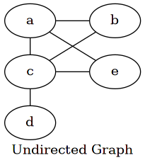
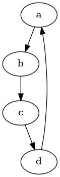
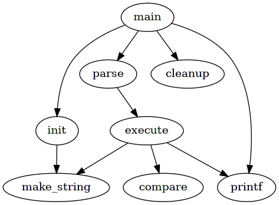
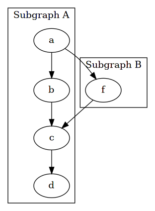
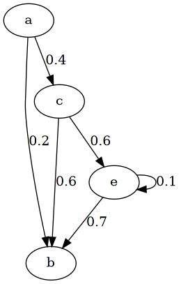
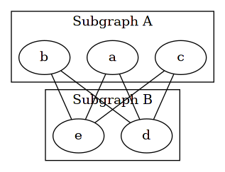

#+setupfile: ../setup.org

#+hugo_bundle: graphviz-examples
#+export_file_name: index

#+title: Graphviz Examples
#+date: <2021-03-22 一 14:48>
#+hugo_categories: Tool
#+hugo_tags: tool graphviz drawing
#+hugo_draft: true
#+hugo_custom_front_matter: :comment false :featured_image images/featured.png

* usage

安装相应软件包

#+begin_example
$ pacman -S graphviz xdot
#+end_example

新建 =test.dot= 文件，保存绘图代码。

使用 xdot 实时预览，

#+begin_example
$ xdot test.dot
#+end_example

绘图结果，生成 png 图片，

#+begin_example
$ dot -Tpng -o test.png test.dot 
#+end_example

* graph

** undirected

 #+begin_src dot :file images/undirected-graph.png :exports both
 graph {
    label="Undirected Graph";
    rankdir=LR;
    { rank=same; a, c, d };
    splines=line;

    a -- b -- c -- e -- a;
    a -- c -- d;
 }
 #+end_src

 #+RESULTS:
 

** directed

 #+begin_src dot :file images/directed-graph.png :exports both
 digraph {
     a -> b;
     b -> c;
     c -> d;
     d -> a;
 }
 #+end_src

 #+RESULTS:
 

** subgraph

*** asynomous
    
#+begin_src dot :file images/subgraph.png
digraph G {
  main -> init -> make_string;
  main -> {parse, cleanup};
  main -> printf;
  parse -> execute -> {make_string, compare, printf};
}
#+end_src

#+RESULTS:

*** named

Subgraph name must start with prefix ~cluster~.

#+begin_src dot :file images/subgraph-named.png :exports both
digraph {
    subgraph cluster_0 {
        label="Subgraph A";
        a -> b;
        b -> c;
        c -> d;
    }

    subgraph cluster_1 {
        label="Subgraph B";
        a -> f;
        f -> c;
    }
}
#+end_src

#+RESULTS:

* edge

** label
  
#+begin_src dot :file images/edge-label.png
digraph {
    a -> b[label="0.2"];
    a -> c[label="0.4"];
    c -> b[label="0.6"];
    c -> e[label="0.6"];
    e -> e[label="0.1"];
    e -> b[label="0.7"];
}
#+end_src

#+RESULTS:

** straight line

#+begin_src dot :file images/edge-straight.png
graph {
    splines=line;
    
    subgraph cluster_0 {
        label="Subgraph A";
        a; b; c
    }

    subgraph cluster_1 {
        label="Subgraph B";
        d; e;
    }

    a -- e;
    a -- d;
    b -- d;
    b -- e;
    c -- d;
    c -- e;
}
#+end_src

#+RESULTS:

* table

#+begin_src dot :file images/table.png
digraph {
	format[label=<
	      <table border="1" cellspacing="4">
	        <tr>
		  <td border="0" bgcolor="white">资产</td>
		  <td border="0" bgcolor="white">  =  </td>
		  <td border="0" bgcolor="white">  负债  </td>
		  <td border="0" bgcolor="white">  +  </td>
		  <td border="0" bgcolor="white">所有者权益</td>
		</tr>
	        <tr>
		  <td border="0" bgcolor="white">现金</td>
		  <td border="0" colspan="3" bgcolor="white"></td>
		  <td border="0" bgcolor="white">资本</td>
		</tr>
	        <tr>
		  <td border="0" bgcolor="white">+400,000</td>
		  <td border="0" colspan="3" bgcolor="white"></td>
		  <td border="0" bgcolor="white">+400,000</td>
		</tr>
	      </table>
	       >, shape=none]
}
#+end_src

#+begin_src dot :file images/table-hr-vr.png
digraph {
	format[label=<
	      <table border="0" cellspacing="4">
	        <tr>
		  <td border="0" colspan="2" bgcolor="white">现金</td>
		</tr>
		

	        <tr>
		  <td border="0" bgcolor="white">左边</td>
		  <vr/>
		  <td border="0" bgcolor="white">右边</td>
		</tr>
	        <tr>
		  <td border="0" bgcolor="white">现金增加</td>
		  <vr/>
		  <td border="0" bgcolor="white">现金减少</td>
		</tr>
	      </table>
	       >, shape=none]
}
#+end_src

* ref

https://blog.csdn.net/youwen21/article/details/98397993

https://www.cnblogs.com/shuqin/p/11897207.html

https://stackoverflow.com/questions/10147619/how-can-i-reverse-the-direction-of-every-edge-in-a-graphviz-dot-language-graph

https://stackoverflow.com/questions/43599738/graphviz-alignment-of-subgraph

https://renenyffenegger.ch/notes/tools/Graphviz/examples/index

https://graphs.grevian.org/reference

https://graphviz.gitlab.io/documentation/

http://graphviz.org/doc/info/attrs.html

