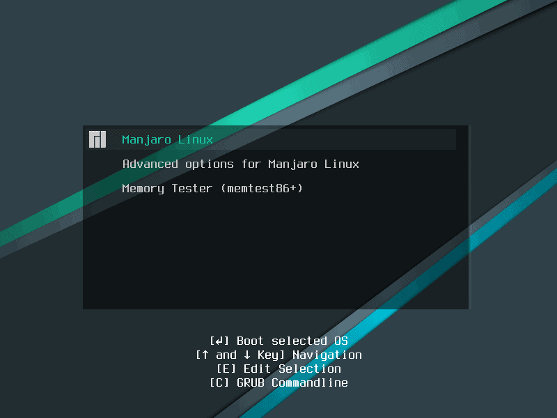

#+setupfile: ../setup.org

#+hugo_bundle: grub-find-win-back
#+export_file_name: index

#+title: 记一次 Grub 找回 Win10 启动项的过程
#+date: <2021-03-09 二 17:42>
#+hugo_categories: Linux
#+hugo_tags: grub boot
#+hugo_custom_front_matter: :featured_image images/featured.png

#+begin_comment

#+end_comment

本人的笔记本有两块硬盘，分别安装了 Win10 和 Manjaro 系统，默认使用 grub 进行多系统引导。

今天在 Manjaro “常规升级”之后，重启后发现引导项中 Win10 消失了。

根据 Arch Wiki[fn:1] 的描述，使用 =os-prober= 工具来检测多系统，Win10 是可以正常检测到的。

#+begin_example
$ sudo os-prober
/dev/sda1:Windows 10:Windows:chain
#+end_example

尝试运行 =grub-mkconfig= 观察引导项的生成结果时，发现了这样一段注释，

#+begin_example
$ sudo grub-mkconfig
#
# DO NOT EDIT THIS FILE
#
# It is automatically generated by grub-mkconfig using templates
# from /etc/grub.d and settings from /etc/default/grub
#
........................
........................
........................
### BEGIN /etc/grub.d/30_os-prober ###
os-prober will not be executed to detect other bootable partitions.
Systems on them will not be added to the GRUB boot configuration.
Check GRUB_DISABLE_OS_PROBER documentation entry.
### END /etc/grub.d/30_os-prober ###
........................
........................
........................
#+end_example

原来 grub 是 *默认运行* =os-prober= 的，新版本之后反而将默认行为修改为 *禁止运行* 了。

根据注释中的提示，修改配置文件 =/etc/default/grub= [fn:2]，添加配置项

#+begin_example
GRUB_DISABLE_OS_PROBER=false
#+end_example

重新执行 =update-grub= ，引导项就恢复正常了

#+begin_example
$ sudo update-grub
正在生成 grub 配置文件 ...
找到主题：/usr/share/grub/themes/manjaro/theme.txt
找到 Linux 镜像：/boot/vmlinuz-5.4-x86_64
找到 initrd 镜像：/boot/intel-ucode.img /boot/initramfs-5.4-x86_64.img
Found initrd fallback image: /boot/initramfs-5.4-x86_64-fallback.img
找到 Linux 镜像：/boot/vmlinuz-4.19-x86_64
找到 initrd 镜像：/boot/intel-ucode.img /boot/initramfs-4.19-x86_64.img
Found initrd fallback image: /boot/initramfs-4.19-x86_64-fallback.img
警告： os-prober was executed to detect other bootable partitions.
It's output will be used to detect bootable binaries on them and create new boot entries.
找到 Windows 10 位于 /dev/sda1
Found memtest86+ image: /boot/memtest86+/memtest.bin
完成
#+end_example

[fn:1]: https://wiki.archlinux.org/index.php/GRUB#Detecting_other_operating_systems

[fn:2]: https://zhuanlan.zhihu.com/p/341300483

