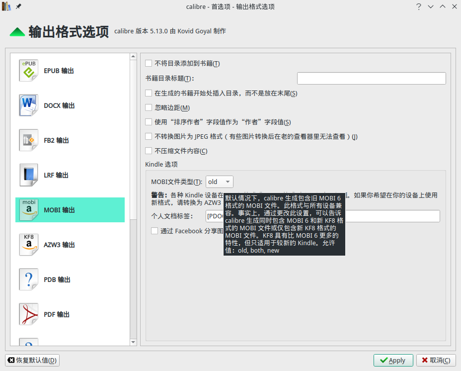
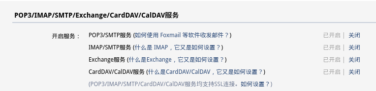
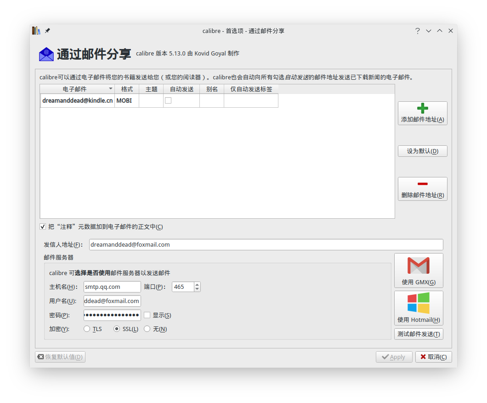
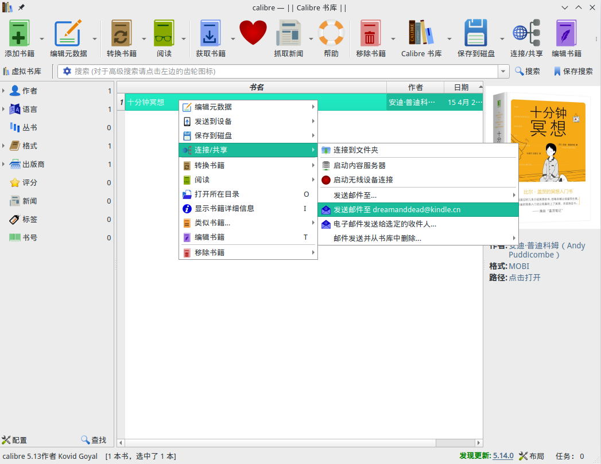

#+setupfile: ../setup.org

#+hugo_bundle: kindle-kf8-mobi
#+export_file_name: index

#+title: Useful Tips for Kindle
#+date: <2021-03-31 三 18:15>
#+hugo_categories: Tool
#+hugo_tags: kindle mobi reading
#+hugo_custom_front_matter: :featured_image images/featured.jpg

图书馆服务是 kindle 阅读器的一大亮点。
服务器存储个人上传的电子书，而且支持多端同步注释与阅读进度。

本文介绍几个建议，如何更好的使用这项服务。

* Use KF8 Mobi

电子书的本质并不复杂。通过 html 来组织内容，通过 css 控制样式。
电子书和阅读器的关系近似于网页和浏览器的关系。

常见电子书格式有 4 种，epub，mobi，azw 和 azw3[fn:5]。
epub 是开源格式。
amazon 认为 epub 由社区发展，
不能很快符合自身的发展需求，于是在之上开发了 mobi。
当前使用的 mobi 有两个版本，KF6 和 KF8，
azw 和 azw3 就是分别在 mobi KF6 和 KF8 上添加了一层“外壳”，
用于版权保护[fn:2]。

KF8 相比 KF6 可以在 kindle 阅读器上
呈现更丰富的样式，
支持自定义更换字体，
缺点是无法呈现书籍封面缩略图（在 android kindle app 可以，在 kindle 阅读器上不行）。

邮件传书不支持 azw3 格式，只支持 mobi[fn:1]，
为了阅读 KF8 的电子书，需要将 azw3 转换为 mobi KF8。

calibre 支持转换为 KF8 格式，但是经实践，
转换得到的电子书无法通过 amazon 审核，发送不成功。

#+caption: calibre 支持转换 KF8 的选项

另一种转换的方式来自论坛 [[https://www.mobileread.com/forums/][mobileread]]。
使用 python 脚本解包 azw3 电子书[fn:3]，
配合官方 kindlegen 工具加工生成 mobi KF8 电子书[fn:4]。

其过程并不复杂。

下载 python 脚本 [[https://www.mobileread.com/forums/attachment.php?attachmentid=168073&d=1543614967][KindleUnpack-081.zip]]，解压如下，

#+begin_example
kindleunpack/
├── COPYING.txt
├── DumpMobiHeader_v022.py
├── KindleUnpack_lin.json
├── KindleUnpack.pyw
├── KindleUnpack_ReadMe.htm
├── lib
│   ├── compatibility_utils.py
│   ├── __init__.py
│   ├── kindleunpack.py
│   ├── mobi_cover.py
│   ├── mobi_dict.py
│   ├── mobi_header.py
│   ├── mobi_html.py
│   ├── mobi_index.py
│   ├── mobi_k8proc.py
│   ├── mobi_k8resc.py
│   ├── mobiml2xhtml.py
│   ├── mobi_nav.py
│   ├── mobi_ncx.py
│   ├── mobi_opf.py
│   ├── mobi_pagemap.py
│   ├── mobi_sectioner.py
│   ├── mobi_split.py
│   ├── mobi_uncompress.py
│   ├── mobi_utils.py
│   ├── unipath.py
│   └── unpack_structure.py
├── libgui
│   ├── askfolder_ed.py
│   ├── __init__.py
│   ├── prefs.py
│   └── scrolltextwidget.py
└── README.md
#+end_example

查看其帮助选项，

#+begin_example
$ python kindleunpack/lib/kindleunpack.py --help
KindleUnpack v0.81
   Based on initial mobipocket version Copyright © 2009 Charles M. Hannum <root@ihack.net>
   Extensive Extensions and Improvements Copyright © 2009-2018 
       by:  P. Durrant, K. Hendricks, S. Siebert, fandrieu, DiapDealer, nickredding, tkeo.
   This program is free software: you can redistribute it and/or modify
   it under the terms of the GNU General Public License as published by
   the Free Software Foundation, version 3.
option --help not recognized

Description:
  Unpacks an unencrypted Kindle/MobiPocket ebook to html and images
  or an unencrypted Kindle/Print Replica ebook to PDF and images
  into the specified output folder.
Usage:
  kindleunpack.py -r -s -p apnxfile -d -h --epub_version= infile [outdir]
Options:
    -h                 print this help message
    -i                 use HD Images, if present, to overwrite reduced resolution images
    -s                 split combination mobis into mobi7 and mobi8 ebooks
    -p APNXFILE        path to an .apnx file associated with the azw3 input (optional)
    --epub_version=    specify epub version to unpack to: 2, 3, A (for automatic) or 
                         F (force to fit to epub2 definitions), default is 2
    -d                 dump headers and other info to output and extra files
    -r                 write raw data to the output folder
#+end_example

以电子书 [[file:images/十分钟冥想.azw3][十分钟冥想.azw3]] 为例，解压到 =unpack_output= 目录，

#+begin_example
$ python kindleunpack/lib/kindleunpack.py -i -s ./十分钟冥想.azw3 ./unpack_output/
#+end_example

解压内容如下，

#+begin_example
$ tree ./unpack_output/
unpack_output/
├── HDImages
├── mobi7
│   └── Images
│       ├── cover00128.jpeg
│       ├── image00129.jpeg
│       ├── image00130.jpeg
│       ├── image00131.jpeg
│       ├── image00132.jpeg
│       ├── image00133.jpeg
│       ├── image00134.jpeg
│       ├── image00135.jpeg
│       └── image00136.jpeg
└── mobi8
    ├── 十分钟冥想.epub
    ├── META-INF
    │   └── container.xml
    ├── mimetype
    └── OEBPS
        ├── content.opf
        ├── Fonts
        ├── Images
        │   ├── cover00128.jpeg
        │   ├── image00130.jpeg
        │   ├── image00131.jpeg
        │   ├── image00132.jpeg
        │   ├── image00133.jpeg
        │   ├── image00134.jpeg
        │   ├── image00135.jpeg
        │   └── image00136.jpeg
        ├── Styles
        │   ├── style0001.css
        │   └── style0002.css
        ├── Text
        │   ├── cover_page.xhtml
        │   ├── part0000.xhtml
        │   ├── part0001.xhtml
        │   ├── part0002.xhtml
        │   ├── ..............
        │   ├── ..............
        │   ├── ..............
        │   ├── ..............
        │   ├── part0092.xhtml
        │   ├── part0093.xhtml
        │   └── part0094.xhtml
        └── toc.ncx
#+end_example

下载安装 kindlegen 工具[fn:4]，

#+begin_example
$ kindlegen

*************************************************************
 Amazon kindlegen(Linux) V2.9 build 1028-0897292 
 A command line e-book compiler 
 Copyright Amazon.com and its Affiliates 2014 
*************************************************************

Usage : kindlegen [filename.opf/.htm/.html/.epub/.zip or directory] [-c0 or -c1 or c2] [-verbose] [-western] [-o <file name>] 
Note: 
   zip formats are supported for XMDF and FB2 sources
   directory formats are supported for XMDF sources
Options: 
   -c0: no compression 
   -c1: standard DOC compression 
   -c2: Kindle huffdic compression 
   -o <file name>: Specifies the output file name. Output file will be created in the same directory as that of input file. <file name> should not contain directory path. 
   -verbose: provides more information during ebook conversion 
   -western: force build of Windows-1252 book 
   -releasenotes: display release notes 
   -gif: images are converted to GIF format (no JPEG in the book) 
   -locale <locale option> : To display messages in selected language 
      en: English
      de: German
      fr: French
      it: Italian
      es: Spanish
      zh: Chinese
      ja: Japanese
      pt: Portuguese
      ru: Russian
      nl: Dutch
#+end_example

将解包得到的 epub KF8 转换为 mobi，

#+begin_example
$ kindlegen unpack_output/mobi8/十分钟冥想.epub -c2 -verbose -o 十分钟冥想.mobi
#+end_example

文件生成到 =unpack_output/mobi8/十分钟冥想.mobi= 。

用 calibre viewer 打开，可以看到 KF8 的标识，说明转换成功。

#+caption: kf8 标识

当然，这种方式也不是百试百灵的，可能小概率会遇到以下问题
- 部分文件使用 kindlegen 转换失败，无法生成 mobi
- 部分文件使用 kindlegen 转换得到的 mobi 内容是乱码
如果遇到以上问题，建议使用其它 azw3 文件再试一下。

* 配置 calibre 邮件发送

kindle 图书馆服务中的电子书是通过邮件附件来上传的（没错，在 21 世纪）。
如果每次都使用邮箱客户端来发送，未免太不方便。
可以在 calibre 中进行配置 smtp，直接一键传书，更为便捷。

以 qq 邮箱为例，在设置-帐户中，开启 smtp 服务，同时得到授权码。

#+caption: 开启 smtp 服务

在 calibre 的设置-电子邮件分享选项板，
- 电子邮件为 kindle 图书馆的邮箱地址，格式选择 mobi
- 发信人地址填写 qq 邮箱
- 主机名:端口为 =smtp.qq.com:465=
- 用户名为邮箱地址，密码为授权码
- 协议选择 SSL

#+caption: calibre 配置邮件共享

配置结束后，就可以一键上传书籍。

#+caption: 一键上传书籍

* License

#+begin_export markdown

#+end_export

* Footnotes

[fn:1]: https://www.amazon.cn/gp/help/customer/display.html?nodeId=200767340&ref_=pe_1825130_138612650  

[fn:2]: https://zhuanlan.zhihu.com/p/43996780

[fn:3]: https://bookfere.com/post/187.html
[fn:4]: https://bookfere.com/post/92.html
[fn:5]: http://jdkindle.com/skill/4415/
