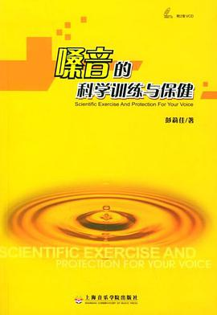
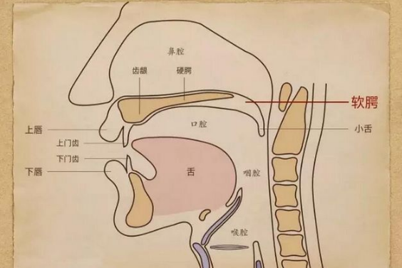
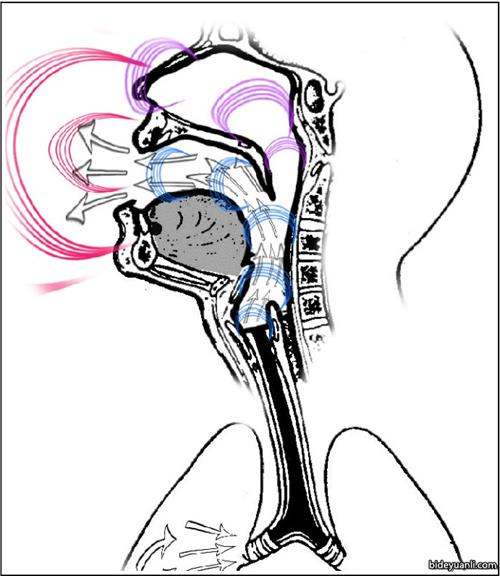
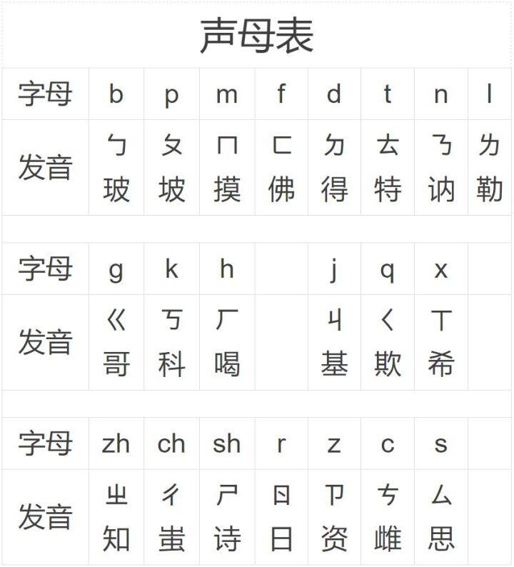
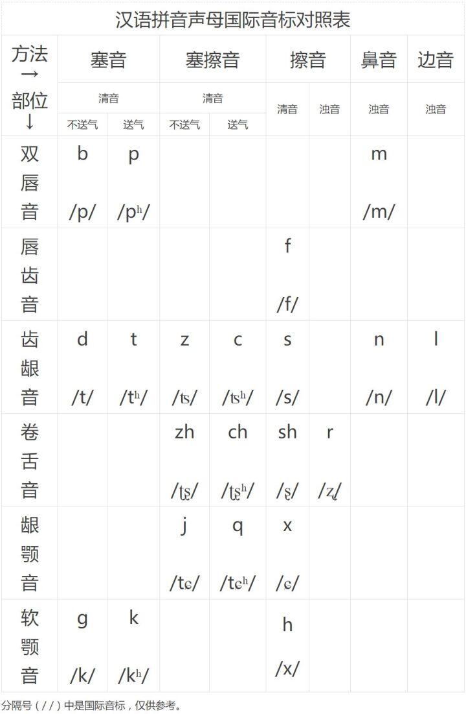
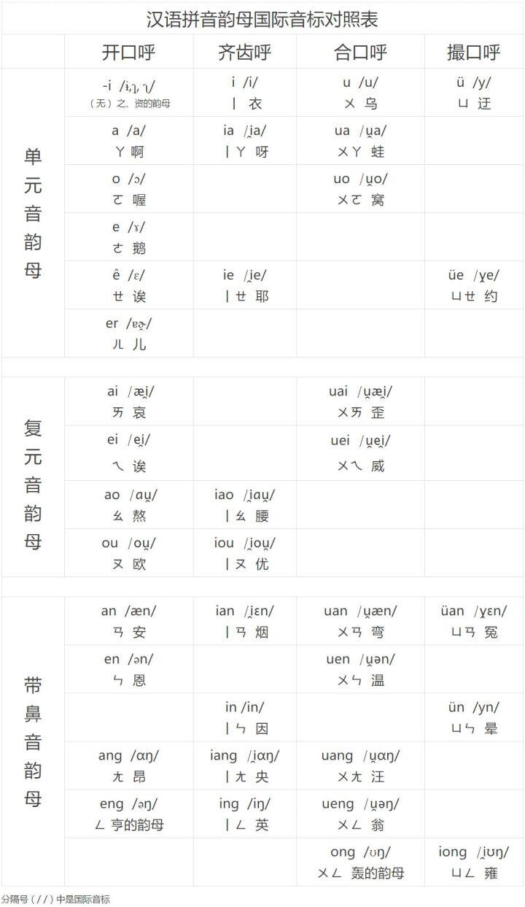

#+setupfile: ../setup.org

#+hugo_bundle: right-voice
#+export_file_name: index

#+title: 如何有效地发声
#+date: <2021-04-03 六 22:01>
#+hugo_categories: Theory
#+hugo_tags: theory voice self
#+hugo_custom_front_matter: :featured_image images/featured.jpg

本文是一篇读书总结，由[[https://book.douban.com/subject/1288733/][《嗓音的科学训练与保健》]]整理而来，
学习如何改进发声的方式。

#+caption: 封面

容貌，形体，声音，构成一个人的整体形像。
容貌关乎穿着打扮，形体关乎礼仪修养，
声音则关乎发声质量。

长期以来，并不是特别喜欢自己的声音。
说话很浅，柔弱无力，气息不合理。
好在人声具有后天的可塑性，
有机会寻求一次改变，探索如何更有效地发声。

* 人声

一个典型的乐队，由主唱，吉他手，贝斯手，鼓手组成。
吉他手弹奏吉他，贝斯手演奏贝斯，鼓手打鼓，
主唱演绎人声。
  
*人声就像一把乐器。*

这把乐器的发声原理和其它乐器是相似的。
由肺部呼出气流，吹动声带产生振动，
通过人体共鸣腔的增强，发出我们听到的声音。

讨论声音，离不开音量，音高，音色三个要素，人声也一样。

音量的大小，从物理角度而言，和振幅有关。
一种方式是，用更大的气流，声带被冲击而产生更大的振幅，可以增大音量。
但是声带毕竟很脆弱，现实生活中，这种方式并不可取。
另一种方式，在发声时，保持共鸣器官松开，产生更大的共振空间，
由共鸣的作用，音量就会得到加强，这是最有效最科学的方式。
其实由声带引发的振动，振幅非常小，别人是听不到的，
他人听到的都是通过共鸣腔修饰过的声音，
如胸腔共鸣浑厚，头腔共鸣明亮。

音高的高低，和振动的频率有关。
声带松弛，振动频率就低，音高就低；反之则相反。

音色是独特的，和声音的[[https://bideyuanli.com/p/3238][泛音]]相关。
我们对音色的感知，是由基音，和第一泛音，第二泛音，...，的叠加作用而形成的。
音高指的是基音的频率，相同音高下，存在多种音色。
这一点和声带，共鸣腔，气息相关，每个人都是不同的，
这也是为什么不同的人发声感觉不同的原因。

有效的发声方法是科学的，遵循发声原理的。
声音是由呼吸，声带，共鸣腔整体协调形成的。
很多人习惯用喉头控制声音，这一点是低效且不科学的，
发声的关键在于气息通畅，共鸣和谐。

开怀大笑是很科学的发声活动。
大笑时，肚子发硬，
气息富有弹性，
喉头毫不费力，
外部肌肉非常放松，
这种肌肉之间的协调方式非常值得学习。

使用腰腹的力量控制气息，而不是用胸肩喉来发力控制。
耸肩塌胸，挤捏喉咙的方式非常不可取，
不仅费力，而且严重影响共鸣腔的空间。

所以说话时心中常记得，用笑的气息，在笑的位置上发声。
简单总结是，三用力，三放松原则。

三用力
- 横膈膜，保持气息的压力
- 笑肌，扩大口腔空间
- 软腭，扩大咽腔空间

三放松
- 下巴，避免喉头紧张
- 舌头，不影响口腔空间
- 喉头，不影响声带的表现，扩大喉腔空间

* 气息

#+begin_quote
气乃音之帅也。
#+end_quote

气息是发声的动力核心。
气流的速度，影响声带振动的频率，进而影响音高。
气流量的大小，影响发声的时间长短，毕竟一口气是有限的。

腹式呼吸是最为推崇的发声呼吸方法，
如何体会正确的进行腹式呼吸？

读者可以先体验一下三种不正确的情况。

1. 将鼻子和嘴巴阻塞，腹部再用力收缩/扩张，也无法进行呼吸。
2. 强行将腹肌控制住，仅凭口鼻来尝试呼吸，会遇到相当大的阻力。
3. 口鼻放松，胸部腹部也非常放松，扩充腹部吸气，收缩腹部呼气，
   气流没有弹性，气流的压力很小。

总结上面的经验，正确的腹式呼吸：
- 口鼻完全打开通畅，不阻碍呼吸通道；
- 吸气时，胸部，腹部自然打开；
- 呼气时，保持这种打开的感觉，
  腹部保持一定的紧张度，和腹部收缩的力量形成对抗，
  保持一定的胸廓内压，腹部内压
- 在此基础上收缩横膈膜，气流才有压力和弹性

简单的总结，即保持吸气的感觉来呼气，来发声。

#+begin_quote
“我只用刚刚够唱每个音所需要的这么多的气息” —— 歌唱家卡鲁索
#+end_quote

明确呼吸方法之后，可以更进一步，用最省气的方式来发声，
每次只用“刚刚够”发音所需的气息，
节制气息流量，延长气息使用时间。
保持稳定的气息压力，避免毫无控制的放掉气息，
是使用呼吸最理想的状态。

* 共鸣

[[https://bideyuanli.com/p/426][共鸣]]，是物体因共振而发声的现象。
共振的本质，是能量的积聚。
比如大桥被风吹断的现象，是典型的共振现象。

#+caption: 塔科马海峡大桥共振

风力其实并不大，只是大桥将风的能量存储起来，
导致振幅越来越大，最终导致桥梁坍塌。
就像是推别人荡秋千，只需要在最高点轻轻一推，
能量慢慢地积累起来，秋千就会越荡越高。

共鸣对于发声的作用很大，
1. 扩大音量。
   将声带初始小的振动，积累成大的振动，
   提高振幅，即提高声音的音量。
2. 塑造音色。
   每个共鸣腔都有自身特定的共振频率，
   频率相匹配的声音被加强，其它频率的声音被减弱，
   混合不同共鸣腔的声音，可以塑造不同特点的音色。

共鸣的关键，就在于共鸣腔。

#+caption: 主要腔体
   
   
** 喉腔

声带长在喉腔里，
所以喉腔是声音的发源地，
是共鸣的第一个腔体，

喉部肌肉主要有喉内肌和喉外肌。
喉内肌用于精确控制声带。
喉外肌用于控制喉位，比如吃饭时的喉部运动。

原则上，发声时需要放松喉外肌。
如果喉外肌紧张，就会减小喉腔的共鸣空间，阻止气流的通畅，
并妨碍声带正常工作。
所以发声时，喉咙使劲往内挤卡，气息使劲向外冲撞，
这种方式是非常不可取的。

** 咽腔

咽腔上通下达，是共鸣的交通枢纽站。
保持咽腔宽阔畅通，可以更好的引发上下共鸣腔联合共鸣。

#+caption: 共鸣作用

** 口腔

口腔是最灵活的腔体，
颌，嘴唇，舌头，软腭都可以引起腔体空间的变化。

发声时，前嘴要略微收小，使声波留在内部共振，不至于过快分散。
软腭向上抬起，增大口腔容积，增强口腔共鸣效果。

** 头腔

头腔是以鼻腔为主的上部腔体。   

引导声音进入通畅的鼻咽腔，得到高位置的共鸣，
得到的声音尖而高，声色更加明亮。

** 胸腔

胸腔就是气管与支气管组成的空间。

共鸣产生的声音低而沉稳，深厚，音色雄浑宽广。

* 咬字

口腔是字音的制造器。
口型准确，字音才准确。

汉语发声的特点是一字一音，棱角分明。
前人根据发声经验，将字音分成字头，字腹，字尾三部分。

发声开始时，口腔肌肉紧缩，发出短促有用的音素，称为字头；
之后口腔阻力完全突破，
字音延伸发展到了高潮阶段，
内部肌肉松开扩充，容积增大，
带出响亮的音素，称为字腹；
字音消失前的收尾阶段，
口腔收拢到闭合而发出的音素，称为字尾。

三种音素有各自的发音原则。

字头咬字要重。
字头发声时，一般加强口腔肌肉的摩擦力量，
产生一定的爆发力，使出字喷弹有力。

字腹吐音要圆。
字腹是共鸣最丰满的部分，元音响亮且时值长。
字头擦出后，口腔肌肉放松，适度打开口腔，
抬软腭，稳定喉头，
气流通畅的流动，不摩擦，
充分发挥共鸣作用。

字尾收韵要轻。
字尾发音时，肌肉放松，气流减弱，音量减小，
短暂而轻柔。

重咬，圆吐，轻收，环环相扣，
话语流动连贯一气，颗粒清楚。

** 拼音

字头，字腹，字尾和拼音有着明显的关系。
讨论更多细节之前，先温习一下拼音基础。

[[https://www.bilibili.com/read/cv5036727/][汉语拼音]]，指普通话拼音，
是一种用拉丁字母为汉字标音的方案。

一个完整音节由声母和韵母组成，
声母是韵母前的辅音。

声母通常响度低、不能任意延长；
韵母响度大、能延长、有音节核心。
两者近似为字头和字腹。

*** 声母

#+caption: 声母表

#+caption: 声母国际音标对照表

此外还有零声母。
一个音节的“前置辅音”称为声母，元音和“后置辅音”一起称为韵母。
当一个字只有元音或元音和“后置辅音”，没有“前置辅音”，
则认为声母为零声母。

*** 韵母

韵母是一个音节中除声母外的部分，
由韵头、韵腹、韵尾组成。

韵头是位于声母和主要元音之间的过渡音，也称介母。

韵尾是韵腹后面的音。

韵腹的识别按照如下规则，
- 韵母只有一个元音（如a），
  或者一个元音带一个鼻辅音（如an）时，
  该元音（a）称为韵腹，所带的鼻辅音称为韵尾
- 韵母由两个元音构成（如ao、ie），开口度较大的元音为韵腹（a e），
  余下的元音若在韵腹前则称为韵头（i），若在韵腹后则称为韵尾（o）。
- 韵母有三个元音（如iou），或者两个元音带一个鼻辅音（如ueng）的话，
  则中间的元音是韵腹（o e），第一个元音是韵头（i u），韵腹后的元音或鼻辅音为韵尾（u ng）。

韵母按结构，分为单韵母、复韵母和鼻韵母三类；
按口形分为四类，开口呼（a、o、e、ê）、齐齿呼（i）、合口呼（u）和撮口呼（ü）。

#+caption: 韵母国际音标对照表

** 字头

字头，基本对应声母。
发音讲究唇舌喷弹有力，
将整个字音响亮的送出口外。

不同的字头有不同的用力方法。

| 音          | 类别     | 强调   |
|-------------+----------+--------|
| b p         | 双唇音   | 喷     |
| f           | 唇齿音   | 擦     |
| d t l       | 舌尖中音 | 弹     |
| m n         | 鼻音     | 导     |
| g k h       | 舌根音   | 啃     |
| j q x       | 舌面音   | 挤     |
| zh ch sh r  | 舌尖后音 | 翘舌擦 |
| z c s       | 舌尖前音 | 平舌擦 |
| a o e i u ü | 零声母   | 聚拢   |

*** b p f

b p 发音时，
双唇闭合，唇肌收紧，抓紧牙齿，
喷气冲击双唇，发出清脆短促的唇音。

f 发音时，上齿下唇接触，其它与 b p 动作相同，
唇齿分开动作稍慢，使气流摩擦出声。

着力点集中在两唇内侧尽可能小的中间部位，
不要将力量分布在整个嘴唇。

*** d t l

d t l 发音时，
舌尖有一定的紧张度，中后部放松，
舌尖中央的点顶住上齿牙龈阻气。
除阻动作果断有力，气流一过舌面，
舌尖立即敲响舌尖音，离开上牙龈。

*** m n

m n 是唯一使用声带发音的声母，
其它声母发声时都不使用声带。

m n 发音时，软腭下降，鼻腔通畅，
将带音气流导入鼻腔，再跟后面的韵母拼出字。
鼻音要略长些，与韵母有明显的拼接过程。

*** g k h

g k h 发音时，舌头略微后缩，舌根前部隆起与软腭硬腭交界处接触，
（h 不完全接触），
气流冲出，圆滑而快速地彼此跳开，
舌根向下，软腭向上。

h 容易产生漏气现象，要将舌与腭靠近，使口腔通道变窄，
控制气流冲击力度，减少呵气时间，节约气息。
  
*** j q x

j q x 发音时，
舌尖下垂，轻抵下门齿背的下部，保持不离开，
舌面向上隆起，与硬腭前部有力的挤贴（x 不完全贴紧），
以阻住气流。

发音时，舌前部轻轻离开硬腭，形成窄缝，
气流从舌面形成的窄缝中摩擦冲出。

*** zh ch sh r

zh ch 发音时，
舌头后缩，舌尖翘起顶住硬腭与上齿交界处阻气
（sh r 舌尖与硬腭留一窄缝），
慢慢打开，气流从缝隙中冲出，摩擦出声。
  
*** z c s

z c 发音时，
舌尖平伸，顶在上齿龈后阻气，
舌尖稍微离开齿龈，在缝隙间擦气发出声音。
s 发音时，保持 z c 舌头离开齿龈时的状态，气流摩擦出声。

除阻之后，马上加上韵母，不要加入呼读音 -i。

*** a o e i u ü

    零声母分成三种情况。

**** i u ü 开头的复韵母

  此类复韵母，独立形成音节。
  如 ia ie iao iou ian iang iong；
 ua uo uai uei uan uen uang ueng；
 üe üan üen。

这种情况下，将 i u ü 划为字头，因为后续有更响亮的元音。

i u ü 本身是元音，发音时，
缺乏口腔局部闭塞而爆破摩擦出的感觉，
出字时在面上分布的感觉多，不容易发清楚。
所以在发音时，要强调聚拢。
加大齐口 i 合口 u 撮口 ü 的出字时的肌肉收缩力度，
造成气流在收缩部分“点”的瞬间摩擦。

造形时，口腔内相关部位稍稍用力缩窄，减少口腔内的容积，
来加强字头的感觉。
- i 缩窄舌面前部和前硬腭部；
- u 缩窄双唇部；
- ü 缩窄舌面前部和前硬腭部，加上双唇部。

**** 无字头音节

无字头音节，指后面没有更强的元音的韵母。
如韵母 a o e i u ü；
a o e 起头的复韵母（ai an ang ao ou en）。

在发音前，声门有一点稍微阻塞的动作，
敏捷的闭塞一下，声门就马上放松，让元音通畅流出。

**** i u ü 作为介母
     
另一种情况，i u ü 不作为零声母，而是介母，连接声母与主要韵母。

发音时，紧挨着前面闭塞的辅音，在相应辅音摩擦部位聚拢声音的“点”，
尽可能发的短促，清晰。

** 字腹

字腹发音，强调主要元音的共鸣作用。

| 韵母                                               | 字腹 | 强调   |
|----------------------------------------------------+------+--------|
| a ia ua ai uai ao iao an ian uan üan ang iang uang | a    | 高位发 |
| o uo ou iou                                        | o    | 稍靠前 |
| e en uen eng ueng                                  | e    | 抬软腭 |
| ê ie üe ei uei                                     | ê     | 忌扁横 |
| i in ing                                           | i    | 略变圆 |
| u ong iong                                                   | u    | 往前送 |
| ü ün                                                   | ü    | 莫阻气 |
| (zh ch sh r z c s) -i                                                 | -i   | 微带笑 |
| er/儿化音                                             | er   | 松开嘴 |

*** a

a 音很容易打开腔体，带进太多胸声，
所以在发音时，要尽量寻找高位置的共鸣，在鼻梁和眉心碰响。

练习
- 多读和 m n 相接的字，如“骂，那，密码，逆差”，借助鼻音声母的引导作用，
  将 a 音送进头腔，改变声音位置低的习惯
  
*** o

o 的发音着力点比 a 靠后，软腭向上收缩，
形成拱形的口腔状态，胸腔共鸣通畅。
但发 o 音时，嘴唇略微收拢，挡住了部分气流，音色会有些暗闷。

练习 o 发音的着力位置稍靠前，使其通畅的送出口腔外。
- 用 a/i 带动 o 的方式，朗读如“爬坡，打磨，撒播”，
  “笔墨，气魄，稀薄”等词语，获得稍靠前，色调略明亮的音色

*** e

e 的发音着力点与 o 类似，但软腭没有 o 那样抬高，
口腔比较窄小，影响音量和音色。
所以应在发声时稍稍抬高软腭，使口腔的空间增大。

练习
- 使用 g k h 带动的音节，
  如“隔阂，苛刻，合格”，
  借助舌根啃字的弹性力量，
  带动软腭成拱形

*** ê

ê 既有接近 a 的张嘴动作，又有接近 i 的较高着力位置，
容易得到头腔音色。

但是发音时舌头略拱起，软腭略下降，口腔空间变小，
容易扁平僵硬。
所以在发音时，把上下牙齿拉开一点，舌头适当放平，
使舌面与上腭之间的空隙变圆。

练习
- 以 ng 带动 ê 的方法，朗读如“装备，明媚，充沛”等词语，
  加强软腭与舌面抬落开合的力量，扩充口腔后部的共鸣空间

*** i

i 音着力位置高，声带易闭紧，发出高位置音色，
但是口腔通道窄，音量比较小。
所以发音时不要把舌头抬的过高，软腭不要太低，适当放松口腔肌肉。

练习
- 借鉴 ü 音的口腔状态，用 ü 音带动 i 音。
  先发 ü 音，延长并保持口腔内部的圆形状态不变，
  嘴唇稍稍咧开呈微笑状，使音色变为 i。
  反复练习。
- 朗读一些 ü 字腹与 i 字腹组合而成的双音词，
  如“寓意，玉器，绿地”，巩固接近 ü 的声音

*** u

u 音喉位较低，软腭较高，咽喉易形成较长的共鸣通道，
嘴唇收敛为圆孔，口腔容积变窄，声音着力点后移，色彩偏暗淡。
所以尽量把声音往前送，双唇不用太圆太小，不用过分向前伸展，
双唇肌肉绷紧贴着牙齿。

练习
- 使用 a 音带动 u 音的方法。
  先发出自然的 a 音，然后逐渐收拢嘴唇过渡到 u 音。
- 朗读 a 字腹到 u 字腹的词语，
  如“八股，马路，答复”

*** ü

ü 音口腔特点和 i 接近。
i 音口腔肌肉前松后紧，口唇处轻轻展开，舌腭处紧张靠拢；
ü 音相反，前紧后松，口唇处紧张聚拢，舌腭处轻松靠近。

发音时，放松唇肌，开大唇孔，使声音通畅的送出口唇。

练习
- ü 和 i 两个音可以对照练习。
  i 音带动 ü 音的词语，
  如“碧绿，戏剧，继续”

*** -i

-i 在发音时，舌面与上腭比较近，容易产生摩擦声。
所以发音时微微带点笑意，嘴角向两边略翘起，
舌面两侧也微微翘起，舌中部凹下，
加大舌中与上腭之间的距离，减小声音的摩擦。

练习
- 训练方法与 i 相同，用 ü 来带动，
  如“预制，锯齿，律师，女子，旭日，虚词，雨丝”

*** er

在保持 e 音的发音状态下，
一出 e 音就将舌头后缩，舌尖上抬稍卷，
与硬腭中前部相对，可发出 er 音。

由于发音时舌头后缩悬空，阻住部分气流，会减弱声音。
所以发声时嘴巴可以松开点，张大点，增加一些口腔空间。

** 字尾

   

| 韵母                                                            | 字尾     | 强调   |
|-----------------------------------------------------------------+----------+--------|
| a o e i u ü -i ia ie ua uo üe                                   | 无字尾   | 柔和收 |
| ai ei uai ui, ou iu ao iao                                      | 元音字尾 | 流畅收 |
| an en ian in uan un ün üan, ang eng ong iang ing iong uang ueng | 鼻音字尾 | 堵塞收 |

*** 无字尾

无字尾，指音节中没有韵尾。

这种情况下，收音讲究尾音柔和。
字音结束前，气息减弱，音量渐渐收小，
在结束的瞬间，解除口腔肌肉紧张状态。

*** 元音字尾

元音字尾，指以开口度较小的元音韵尾结束的字音。

字音延长时，口型由大到小，归入口型较小的元音位置上，
字腹适度夸张，时值延长，然后平滑转入字尾，收弱声音，时值短，
音不音之间不要出现空隙。

元音字尾都归于 i u 两个音上。

**** i 口半闭收齐齿音

与字腹拼合时，舌体要稍向前滑送，
口腔渐变为半闭状态，使 i 的成分逐渐增多，
归入比 i 略开的位置即可停止。

如 ai ei uai ui。

**** u 唇拢圆收合口音

收音时，双唇逐渐向中间收拢，敛圆，
呈合口或稍合口状态，轻轻归至 u 音或接近 u 音。

如 ou iu ao iao。

*** 鼻音字尾

鼻音字尾，指以鼻辅音韵尾结束的字音。
鼻音字尾音素只有前鼻音 n 和后鼻音 ng。

收音时，在字腹延长阶段，逐渐带上鼻腔音色，
以舌头堵塞口腔，使尾音进入鼻腔，
前鼻音 n 在前面堵塞，舌尖接触硬腭阻气；
后鼻音 ng 在后面堵塞，舌根接触软腭阻气。

**** n 舌尖塞收前鼻韵

收音时，舌尖前半部，抵住上齿龈与硬腭连接处，
在收尾前的刹间，将气息导向鼻腔前方，
舌尖堵塞气流和前鼻音发音动作同时进行，
鼻音不用特别长。

如 an en ian in uan un ün üan。

**** ng 舌根塞收后鼻韵

收音前，主要元音要带上鼻腔音色，
气息一半从鼻出，一半从口出，
最后收音时，以舌根接触软腭，将口中气流阻塞，
全部从鼻出，归入 ng。

如 ang eng ong iang ing iong uang ueng。

*** TODO 13 道韵辙

* TODO 表达

- 追求点，线，管状的用气发声感觉
  - 点，单字有弹性成颗粒
  - 线，一句话语流畅，连贯
  - 管，针对声音的整体感觉，想象胸腹中至头顶有根无形的管子竖立着，
    声音收进管子中，有收束感，不要松散为平面块状

- 不仅来自于身体物理支持，也来自于内心的强壮

* 练习

** 气息

*** 用笑发声

这个练习在于体会呼吸肌的动作。

 - 深吸气，保持软腭，咽喉自然扩充
 - 用膈肌的弹跳力量，发出短促有力的“哈哈”笑声
 - 弹跳的力量集中在“点”上，轻巧快速地弹动
    
*** 吹纸片

这个练习在于找到膈肌和腹肌联合用力呼吸的感觉。

 - 拈起一长条纸片
 - 深吸一口气，感觉气息下沉到腹腔，肚皮胀起来
 - 对着一角持续轻轻吹气，纸片会有规律的颤动
 - 保持均匀的气流，维持尽可能长的吹气时间，肚皮逐渐向腰间瘪进去
 - 坚持 25s 以上
 - 反复多次练习，追求更多的气息储备，和更长的吹气时间

*** 绕口令

这个练习在于体会腹肌节制气息的控制能力。

 - 深吸一口气，保持腹部充实的感觉
 - 轻快而有弹性的读绕口令
 - 尽可能一口气读到 100 字以上，中间不换气，不停顿
 - 感觉无力之时，再坚持多读几个字
  
在有氧运动后，有些气喘时，做这个练习效果更好。

 #+begin_example
 吃葡萄不吐葡萄皮，不吃葡萄倒吐葡萄皮。
 #+end_example

 #+begin_example
 八百标兵奔北坡，炮兵并排北边跑
 炮兵怕把标兵碰，标兵怕碰炮兵炮。
 #+end_example

 #+begin_example
 白石塔，白石搭，白石搭石塔，白塔白石搭。
 搭好白石塔，白塔白又大。
 #+end_example

 #+begin_example
 板凳宽，扁担长，扁担要绑在板凳上，
 板凳不让扁担绑在板凳上，
 扁担偏要板凳让扁担绑在板凳上。
 #+end_example

 #+begin_example
 打南边来了个哑巴，腰里别了个喇叭；打北边来了个喇嘛，手里提了个獭犸。
 提着獭犸的喇嘛要拿獭犸换别着喇叭的哑巴的喇叭；
 别着喇叭的哑巴不愿拿喇叭换提着獭犸的喇嘛的獭犸。
 不知是别着喇叭的哑巴打了提着獭犸的喇嘛一喇叭；
 还是提着獭犸的喇嘛打了别着喇叭的哑巴一獭犸。
 喇嘛回家炖獭犸；哑巴嘀嘀哒哒吹喇叭
 #+end_example

*** TODO 打嘟噜

    配合视频？
    
    舌颤音？

*** TODO 膈肌发力

    - 练习 P56
    - 这里的练习，重点在于如何进行胸腔共鸣

** 共鸣
*** 喉腔

    练习将注意力远离喉咙，喉外肌自然放松。

**** 闻花香

     练习体会喉部放松的感觉

      - 想象眼前有一盆花
      - 如闻花般深深吸一口气
      - 感觉整个呼吸道是通畅的，
        下巴是放松的，喉部是放松的

**** 哼鸣

     克服喉咙发紧，声音漏气的问题

     - 脸部自然放松，轻轻哼响鼻音
     - 感觉声音集中在小舌头振响，朝鼻咽腔往上吹送
     - 每天断续练习十几分钟
     
**** 发 u 延长音

     - 嘴唇撮紧缩小，口腔内尽量松开扩大
     - 舌尖轻抵下牙龈
     - 以腹部的力量推送气息，轻轻发出均匀连贯的 u 音
     - 感觉声音是从竖立在口咽，鼻咽处的长管子里吹响似的，
       吹的脑门嗡嗡作响

**** TODO 字音练习

     - P55
       
*** 咽腔

    参考 练习-咬字-舌肌练习-伸。

*** 口腔

    练习软腭提高的能力和习惯，
    参考 练习-咬字-张嘴训练。
    
**** TODO 朗读训练

     - P50
    
*** 头腔

    练习加强鼻咽共鸣，获得头腔音色。

**** 闭口哼鸣

     - 双唇微闭，舌根抬高，整个舌面与上腭贴紧，口腔内不留空隙
     - 鼻子以闻花香的动作深吸一口气，体会鼻腔，咽腔，喉腔打开的感觉
     - 保持这种通畅，哼出悠长的鼻音
     - 引导声音沿着后咽壁垂直上升

**** 小开口哼鸣

     - 双唇略微松开，舌尖平放，轻舔下齿龈
     - 舌根抬高，贴紧腭舌弓，阻塞气流
     - 方法同上，哼鸣相同音色的声音

**** 大开口哼鸣

     - 嘴巴尽量张大，舌尖伸出
     - 舌根抬高，贴紧腭舌弓，阻塞气流
     - 方法同上，哼鸣相同音色的声音

**** 弹发鼻腔共鸣短音

     以膈肌弹动的力量，交替发出三种形式的鼻腔共鸣短音

     - 靠前双唇阻鼻音 mi ma
       - 音高自然，发声点在鼻腔之前，鼻尖下的人中处
       - 促使硬腭前部拉紧，并使前鼻道中的气息振动
     - 靠中双唇阻鼻音 ni na
       - 稍高于自然音高
       - 发声点在鼻腔中腔，促使软腭中部及后鼻道中的气息振动
     - 靠后双唇阻鼻音 ngi nga
       - 以可胜任的最高音发声
       - 发声点在鼻腔后腔，促使软腭后部的气息振动并扩展鼻咽腔的共鸣

**** TODO 字音练习

*** 胸腔

**** 以笑的方式练发弹跳音

     - 张大口，舌体伸出并放松，带着愉快的表情
     - 笑肌，软腭，小舌头向上提起
     - 使用膈肌推动气息的冲击力量，短促有力的发出颗粒感强的胸腔共鸣声 hei
     - 膈肌随着声音的发出而积极灵活的弹跳
     - 肩胸部保持放松，不要有紧张，抬高的动作

     熟练之后，以同样的感觉来练习 ha ho hu hi 等音节。

**** 拖长腔调长 ǎ 音

     - 深吸一口气，保持喉腔，胸腔宽阔饱满的感觉
     - 以深长的气息支持，均匀稳定的发出略低于日常说话音调的 ǎ 音
     - 保持声音在胸腔内扎实的振响
     - 上部的各共鸣腔也要处于松通的自然状态，使声音不沉闷僵硬

**** TODO 字音练习
     
*** 协调

    建立所有共鸣器官的整体协调，可以在说话时给自己一个意念，“肚皮说话，眉心发声”。

    肚皮说话，强调的是以深入气息支持发声的正确习惯；
    眉心发声，强调的是声音共鸣的高位置聚集点，训练鼻咽后壁挺拔通顺的发声状态。

    两者结合，强调的是放松共鸣器的中间部分，即舌头，下巴，喉咙，肩膀，上胸部，
    （不是松垮的放松，而是有弹性的放松）。
    整体形成通畅的共鸣通道，获得具有立体感的共鸣声响。

    说话前，深吸气，放松全身肌肉，
    想象肚皮眉心成一线，忽略中间其它器官的存在，
    习惯腰腹肌处用力，而鼻咽眉宇轻轻振动的习惯性力量。

**** 轻声哼鼻音转哼元音

     - 双唇微闭，轻轻哼出鼻音，逐渐加大腹部力量，使音量加大
     - 然后将哼鼻音转为哼元音，如 m-a m-i
     - 哼鼻音时将双唇打开，舌根贴着软腭以堵塞口腔
     - 前嘴状态不变，后嘴松开，由哼鸣变成 a / i
     - 注意不要一松开后嘴就把眉心上的点掉下来

**** “哼 哈”跳音练习

     - 嘴形略打开，舌根抵软腭
     - 放松舌头，下巴，喉咙，肩膀，上胸部
     - 腰腹肌弹跳式用力，发出短促的带有胸腔音色的 hng
     - 接着舌根离开软腭，仍靠腰腹肌的弹跳力量，发出带有鼻咽音的 ha
     - 轻巧快捷的反复进行
     - 发音时感受肚皮和眉心两个点，点到为止

**** TODO 字音练习

** 咬字

   口腔体操，锻炼口腔肌肉的力量

*** 张嘴训练

**** 抬头张嘴

     这个练习训练牙关的打开和舌头，下巴的放松。

     - 右手掌根贴紧上胸部，伸直手指固定下巴
     - 放松牙关，用抬头的力量带动口腔上盖自然往上，同时深吸气
     - 用低头的力量带动口腔上盖往下合拢，缓缓呼气

**** 哈欠张嘴

     训练软腭的上举扩张。

     - 自然地打哈欠，使上腭抬起，口咽舒展
     - 在深吸气的作用下充分扩张的状态
     - 保持这种状态，张大嘴不动
     - 气息不进不出，但感觉上气息还在缓缓的吸进去
     - 直到坚持不住

       反复多次练习

**** 惊吓张嘴

     同样训练软腭的力量

     - 倒吸一口凉气
     - 腭咽弓及小舌头会在一瞬间猛然向上收紧
     - 再放松回位

*** 唇肌练习

    锻炼嘴唇的活动能力，使双唇灵活敏捷，增加字音喷发力。

**** 咧

     - 唇齿贴紧
     - 双唇向中间撮拢，感觉唇肌向前伸长拉细，
       力量向两唇的中心点集中
     - 然后，嘴角两边用力，拉伸展开，
       力量均匀分页在两唇相碰的一条横线上
     - 反复多次练习

**** 撇

     - 唇齿贴紧
     - 撮拢噘起双唇，唇肌向前伸长拉细
     - 分别和左，右，上，下四个方向撇伸，交替进行

**** 转

     - 唇齿贴紧
     - 撮拢噘起双唇
     - 用力向左连续转 3 圈，向右连续转 3 圈
     - 交替进行

*** 舌肌练习

    锻炼舌肌的弹性力量和放松能力。

**** 舔

     向上
     
     - 舌尖抵上齿龈
     - 逐渐向上卷起，向硬腭软腭深处舔进去
     - 越深越好，试图舔到小舌头
     - 反复多次

       向下

     - 舌尖抵下齿龈
     - 逐渐向下卷起，向舌底根部舔进去
     - 同时，舌面中部凹下，两边缘紧擦着上大牙向外拱出来

**** 顶

     - 舌尖用力分别顶左右腮帮，越用力越好
     - 用力顶上下内唇

**** 伸

     - 抬头张嘴
     - 只用舌根的力量，伸出舌头，舌根抬高贴紧腭舌弓，舌面下垂，用鼻子吸气，
     - 闭嘴时，舌头缩回口腔，口鼻同时呼气

*** 喷弹发音

**** 喷发唇阻音

     - 闭拢双唇，向内侧中央尽可能小的面积喷气发音
     - 由慢到快，连续快速发出短促有力又清晰的 b b b b ....

**** 喷发舌阻音

     - 微张嘴，以舌尖中央尽可能小的点上用力
     - 由慢到快，连续快速发出短促有力又清晰的 d d d d ....

* License

#+begin_export markdown

#+end_export

