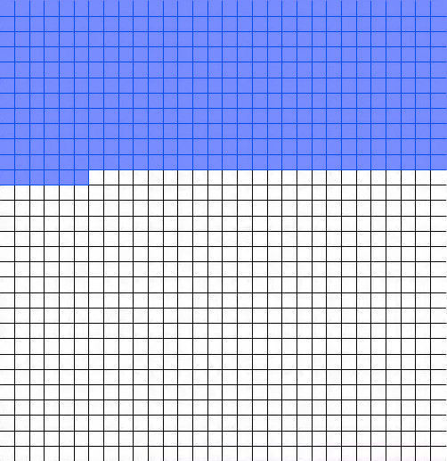

#+setupfile: ../setup.org

#+hugo_bundle: self-cognition-history
#+export_file_name: index

#+title: 自我认知变化史
#+date: <2021-04-03 六 15:04>
#+hugo_categories: Self
#+hugo_tags: self psycology cognition
#+hugo_draft: true
#+hugo_custom_front_matter: :comment false :featured_image images/featured.jpg

人生其实很短。
人生格子[fn:1]强调了这个概念，
假如人生寿命到 75 岁，
每个月代表一个格子，
~75 * 12 = 900 = 30 x 30~ ，
所有时间可以画在 30 乘 30 的格子纸上。

#+caption: 我的人生格子

转眼间，我已经用掉了很多格子。
站在此刻，有一个问题让我不解，为何我会走到这里？
为什么是这里，而不是别的地方？
这种不断的连续发问，成了大脑中不可忽视的噪声，
无法停止。
仔细想想，所有人都在教育你如何向外看，
掌握现实中的技能，而没有人告诉你如何向内审视。

从大学开始，每当有一个想法，冒出一句话，
觉得有价值的就记到笔记上，自以为是有价值的东西。
如今翻阅进行整理之时，多是重复之语。
想法并不能解决问题，只是时刻在自己的状态。

近些时间，学习如何写作。
写作是强大的工具。其中有一种晨写的技巧，
早上起来，什么都不想，
只管写，不干预，
得以捕捉大象的想法，从而在放大镜下审视。
之前大学记录的，就是散落在各个时期的关键认知。

本文站在现在，回顾自我认知的变化史。

- 优点
  - 对软件技术的热忱
  - 喜欢探索新事物
  - 无肥胖困扰
  - 守规矩，良善，无逾越之心
  - 喜爱阅读

- 弱点
  - 对抽象工具的爱，胜过对业务的关心
  - 泛而不精，满足内心的冲动，见异思迁
  - 身体弱，精力不足
  - 被道德困住，心灵并不自由
  - 浏览，无回顾，无思考，重量不重质
  - 因懒惰停止对全局的思考

- 喜欢
  - 强者，坚韧中，不惧风浪
  - 关注人类的褔祉，超越利益
  - 众人中，受人仰慕

- 讨厌
  - 愚蠢，最不可接受之事
  - 单纯的资本运作者，编玩
  - 碌碌无为的平庸之辈

* 经历

#+begin_quote
人生，从教育开始
#+end_quote
  
** 小学

根据弗洛伊德的童年创伤论，
现在的痛苦多是儿时的事情导致的，
一些事件的潜在影响一直影响着内心。
我相信是有一些道理的，但是对于自我一个人来说，
这一点太难证明了。
因为自己对小学及之前的记忆已经非常模糊了，

虽说无法回忆起全部，但还是有一些可回想的深刻记忆。

恐惧。印象是一年级，上学时迟到了，被家长领着到班里。
当时应该是语文课，学习的内容应该是练习写字。
老师在黑板上画了几个米字框，红色粉笔写了好几个字，
让学生们照着写在本子上。
当时感觉那些字好难，每个字都有很多笔画，看起来都很挤，
没有 “大” “天” 这样容易写，虽然这样想着，周围的同学都写的很起劲，
我感觉好无助，实在写不出来，不会读，也不会写，不知道意思，
要交作业怎么办？难道自己这么笨吗？会一直落后下去吗？

学习。
小时候可以玩的东西非常少，自行车就是其中之一。
体验自行车乐趣的前提是，你得会骑。
当时琢磨了好久，怎么都无法掌握平衡，
只能身体侧在一边，一只脚踩地，一只脚踩踏板。
有一天晚上，在学校门口的广场上练了很久，
天色很晚，家长叫我回家，我坚持不要走，
说我快会了，他们还不信，结果我真的骑着车绕了好多圈，
像是魔法一般，真的学会了。

失忆。
小时候出过一次严重的车祸。
据后来别人说，被卡车撞了，圈到了车底。
我倒是一点都没有印象，只知道醒来就在医院，
打吊针，不能动，一直有棒棒糖吃。
其它地方没有大恙，额头被缝了几针，
拆线的时候觉得很吃惊，线居然可以缝在那么薄的皮肤上。
一直有猜想，小时候其它记忆不清楚是车祸导致的，
算了，所幸还活着。

疼痛。
小时候住在县城的中学旁边，
周末时一直到学校里面玩。
当时校园楼里面的楼梯是瓷砖铺的，边缘很尖，
自己上楼时不小心摔倒，手臂就撞在边缘，
把手臂摔断了，轻微骨折。
当时摔的时候并不觉得疼，后面隐隐作疼，停不下来。
到最后打上石膏，夹板，回了老家。

羞愧。
后期小学就回到村子里上了。
当时还是非常放不开，周围的人也不是特别熟。
有一次老师说班上要调座位，让大家讨论坐到哪里。
家长肯定都觉得坐在后面看不到黑板，听不清楚，都想让小孩坐到前面。
后面调座位的时候，老师就问，谁想坐到前排？
我和几个同学举了手。然后被叫到讲台上，面对所有人，一一问，为什么想坐到前面？
有的说自己近视，有的说自己听不清楚，我找不出合适的理由，就说我家人让我坐前面的。
这个回答不怎么妙，当时老师和大家都开始嘲笑，觉得无比羞愧。

** 初中

初中时，就考到了县城的中学。
当时很多人报考，而且我也只是六年级毕业，去尝试报考，
没有经过特别的训练，而且小学时也不觉得成绩是多么的突出，
结果居然考上了，还在前 100 里面，觉得挺惊讶的。

初中时，大家之间散布着一种“谣言”，英语特别的难。
当时小学还没有教英语课，我一点英语也不会，
而且周围的其它人在入学之前就去培训班去提前学习过初中英语，
所以当时我非常焦虑，害怕自己学不好。
到后面才发现这种担心是多余的。因为学校的教学，
以所有人是空白的开始教起，即使没有学过也可以慢慢前进。
我还发现一个现象，有一些之前补习过的人，即使有相应的基础，
长期来看，如果中途不认真学习，这一个优势会慢慢的消失，
甚至到后期会落后。

坦白说，初中的课程并不困难，
因为每一个科目的考试范围是有尽头的。
记得当时自己非常努力，早上起的最早，吃饭非常快，节省时间，
主动买其它辅导书，做没有做过的新题目，保证了这一点，
初中的课程没有什么问题。
这种状态不算是厌学，但是也不算是喜欢学习，当时对学习没有深层次的理解，
老师教什么就是什么，书上写什么就是什么，很少有自己的思考，
自己学习这些是为了什么。

初中时期，最大的就是性格的突变。
说来奇怪，这一点不仅发生在自己身上，也包括后来问过的其它大学同学，
观察到的其它弟弟妹妹的成长，都在这一时期变的和小时候很不一样。
在这个阶段，接触到更大的群体，更多的新鲜事物，
同时内心仿佛和小时候相脱离，成了另一个存在。

有一件印象很深的事，发生在初三之前。
在初一初二时，学校还算是顺利，但是到初三，整个年级进行了换班，
所有原来的同学都分散开来了，面对的是一个新环境，新的同学，新的寝室，新的班主任。
当时非常紧张，第一天几乎一夜未眠，脑海里一直想着假如家人们都离我而去，我该怎么办。
直到第二天，我看到的世界还是蓝色的，但是看到周围的人，
依然来来往往，没有人在乎我在想什么，
但也正是这种不关注，我也有了自信，可以在初三存活下来。

不得不说初中时代留下有很多遗憾。

当时的信仰是唯成绩论，唯一相信智力所代表的东西，毕竟升学也只看这个，
现在看来当时的追求和优越感是非常盲目的。
当时的我是非常抑制运动的，因为我不懂，不会，去了只会出丑，
所以我全部拒绝，只是害怕自己的弱点被大家发现。
如果可以重来，我想在那时发展一项运动，篮球也好，乒乓球也好，
而不是所有时间都闷在教室里面。

当时除了书本上的知识，其它的一切都是陌生的。
对于社会，对于经济，有一种深深的困惑。
为什么街边的商品是这样卖的？为什么公交车是这样运营的？
学校里，那么多陌生的同龄人，在一个区域里来来往往，为什么会这样？
看不懂这一切具体代表着什么。

当时的交友圈子非常的小。
除了自己班级里的同学，几乎和其它班级的同学没有过联系，
包括成绩更为优秀的，或者其它特长的，都没有主动接触过，
不得不说是非常可惜的。

** 高中

- 最为怀念的一次挑战
  - 比初中难
  - 学习方式似乎无法应用
  - 周围更多的强者
  - 数学，理科的学习模式，擅长
  - 由理论的递推，记忆很少，逻辑是万能的
  - 递推
  - 每次考试都当作智力的挑战
  - 英语，用理科思维
    作为语言，应该从使用的角度
    而不是绝对的对错
  - 语文，
    是固化思维无法适应的，
    只能相信是人的天性，有感而发
  - 有关记忆，感性理解，并非没有方法
  - 作文四书
    更多的阅读

    
- 其它后悔之事
  - 忧郁
    - 同样的事情，只是一种思路，不同的角度
    - 基因决定，世界的灰色眼镜
    - 人际的恐惧
  - 很多问题，可以在网络上解决
    私下使用手机
    nokia 的时代

当时还是网吧的时代，没有方便的手机网络，
不能找到更好的资料，不知世界发生了什么，与先进的时代是脱节的。
如果当时有现在这样通畅的网络，自己的眼界一定会更加开阔。

- 转折点
  - 家里买了电脑，但是没有网络
  - 单机游戏
    经典
  - 计算机竞赛的朋友
  - 编程是神秘的事情
  - 未来的专业和职业

- 值得之事
  - 学习篮球
  - 第一次散架
  - 练习跳投
  - 即使多年后，朋友结识友情，认识新朋友的运动
  - 受益于新事物

** 大学

- 自由
  - 大学是自由的   
  - 自由的一无所有
  - 很多人放弃了学习的能力
    仿佛中学时代是被逼迫的一样
  - 等上了名牌大学，就怎么怎么样
    是一个谎言
  
- 能力
  - 自觉能力
  - 自学
    核心课程，最重要是基础课程
    如果老师讲的不好，自己又没有自学，是必定学不好的
  - 搜索能力
    能找到一切资源
    使用好的学习资源

- 考试
  - 垃圾
  - 和高中的含金量无法相比
  - 打印店，买真题

- linux
  - 操作系统课程，接触了 linux
    看到了编程的真理
    不会 linux 就是不会编程
  - 装机数次
    不喜欢 vs 的一套

- 文化
  - 没有看过的经典电影
  - 没有读过的书本

- 自学
  - 技术实力的盲目自信
    认为一切只需要给予一定的时间，就可以学会

- 内心的打击和逃避
  - 算法比赛，只会基础题
  - 遗留了内心比别人聪明，自以为才智超出他人
    在现实面前，不堪一击
    但是没有选择奋进，而选择了逃避与遗忘
  - 没有直面，自己的缺点，去弥补

- 时间的有限
  - 想深入一个方向，但都太深了，无法看到全部
    只能走马观花，加上自己兴趣心太重，什么都要看一点
  - 本科的作用，眼界
  - 学术的深入下去，研究生和博士

- 科学和技术
  - 选择了技术
    像是一个玩具
  - 科技，是两者的结合，不可缺少
  - 技术虽然很强，会语言，会编程，
    涉及到的前端，后端，只需要基本的认知逻辑即可
    并不复杂
  - 如果需要开发 database 云计算 分布式这样的大型软件，
    只有这些技术是远远不够的，
    需要科学研究，论文，底层的支撑。

- 专还是通？
  - 对专的逃避
  - 有无数的兴趣吸引着我
  - 无法忍受对小范围的事，不停的做下去

- 向上
  - 专业的研究生，
    居然叫 boss
    混生活
    有什么意思呢
  - 大学教育的失败

- 就业的困难
  - 对公司的模糊概念
  - 公司需要的是直接上手的人
  - 最好的面试是作品
    而我没有作品

- 与社会对接的桥梁
  - 不只是专业层面，也是
    4 年，如果有高中的精神，很多
    但是大学的 4 年，懒散，出去工作，不过是浪费时间，
    可能是到达法律岁数

- 后悔之事
  - 与人的联结
  - 对人脉的不屑
  - 知识分子的清高
  - 对丑恶之事的逃避

** 实习

 - 做 android 开发的实习生
   - 技术很强
   - python 处理 json 都不懂
   - 虽然大学时我也学习了 git
     git graph 的原理

 - 孤独    
   - 路上是寒冷的
   - 简陋的宿舍里
   - 人是遥远的

 - 对商业的困惑
   - 为什么工作
   - 工作的意义

** 待业

 - 想要成为独立开发者
   - 对正式工作的排斥
   - wordpress 主题
   - 而 web 技术根本不懂
   - 相信自学的力量
   - 不懂商业行为
     没有市场分析，需求设计
     原型图，
     只能反向的一步步去学习
     编写代码时，空无一物
   - 不知道页面是什么样子，
     不知道功能的交互是什么流程，
     大脑混成一团。
   - 注定是不行的。

 - 思考
   - 回到家里，心理混乱
   - 富爸爸与穷爸爸
     4 象限理论
     四类人的不同
   - 尝试画画
   - 锻炼
   - 阅读书籍
   - 资本论最为打动
     资本与工人
     无产阶级
     中产阶级
     原来历史书上的内容，内涵是如此丰富，
     根本就不了解
   - 记录片
   - 动画片
   - 世界在发生着这样强大的变化，
     自己却没有参与其中
     而在浪费生命
   - 去深圳

** 第一

 - 选择
   - 出于对 web 有一些经验
   - 加上对 javascript 的兴趣
   - 在实际中探索
   - 窝在同学家里，中午吃楼下快餐
   - 自学

 - 滑板
   - 危险的事情
   - 只会陷入危险的境地
   - 一种不可避免的倾向

 - 对业务的逃避
   - 技术人只凭借技术兴趣，在工作中是非常困难的，
     因为，那不是公司的重点
   - 商业表象下，底层的技术噪音
   - 最好的语言，最酷的工具
     没有人在乎
   - 作为内心优越感的标签
   - 不在意金钱环境，商业是丑恶的
   - 追逐内心狂热的理想主义
   - 无法忍耐愚蠢之事

 - CSAPP 第 3 版，
   - 跑到图书馆
     做所有习题
     这才是高级的

** 第二

多次梦想的破灭

为了炫耀，理解之后，如此空虚

   
 - 转向运维
   - 潜心技术本身

 - 云计算
   - 惊叹

 - 网络认证
   - cisco
   - 长时
   - 狭窄
   - 维修者？

 - 创造与毁灭
   - 非底层的维护者
   - 没有创造的脚本
   - 遗留的旧系统
   - 清理残局
   - 运维只是工具的使用者
   - 一种架构的构造者

 - 算法
   - 极端思维
   - 书籍成山
   - 被浪潮卷入
   - AI 的狂热
   - 从理论开始
   - 大学时的毅力
   - 小小的项目
   - 时间不足
   - 没有学位，转接工作的困难

 - 限制
   - 第一次，在限制条件下，发现不擅长的事
   - 环境的限制
   - 时间的限制
   - 个人埋头，无法达到的程度

 - AI 有基础的认知
   - 不是人的思维本身，原理不清晰
   - 一切东西都来自于人
   - 机器 AI 参考的资料都来自人的行为
     人是最重要的
   - 用看不懂的东西，去解决看不懂的问题
   - CEO 不要用看不懂的技术

 - 回到人
   - 人 才是最重要的，
   - 商业不过是服务人的团体

 - 技术的地位，不过是支持者
   - 以往从事/面试过的公司，发展的不错
   - 公司作为经济法人，从事的不同方面事
   - 技术工作人员，只是底层供应，做生产的部分
   - 格局小了

 - 尝试开放
   - 大隐隐于市
   - 完全的开放
   - 隐藏自己 到 完全开放，完全透明
   - 闭门造车，到联结
   - 与人的联结
   - 互惠原则，以牙还牙

 - 商业在于参与
   - 恐惧与人交流，就无法参与其中
   - 社会这个大杂烩
   - 技术实力是唯一的
   - 对大家有用的东西

 - 骗局
   - 马克斯的理论
     利润是压榨
   - 经济史是一个骗局，认清它，参与到其中。
   - WallStreet 数次崩溃
   - 看不懂的概念，数次跟风
   - P2P 电子货币 鸡毛
   - 奇怪的环
     人
     生产
     销售
     消费

 - 后悔
   - 多次转向，是由于内心的不成熟，被大象牵走
   - 需要考虑现实问题的时候
     孩子 教育 父母
   - 少的可怜
   - 技术不能解决所有问题
     不是一切

* 认知

** 教育

- 不得不反思教育的意义
  - 即使一路成长到现在，现状并没有更好
  - 教育，应该教人认清社会的真相

- 自我认知
  - 教人如何自学
  - 太多人牺牲了时间，在看视频，打游戏，
    放弃对更好人生的追求

- 低学历的人
  - 无法胜任更高程度的工作
  - 少有向上的渠道
  - 时间都荒弃了
  - 人格的洗涤

- 什么是有益的，有价值的

- 读书
  - 你的问题，99% 先贤都遇到过

** 商业

#+begin_quote
经济体是一个骗局
#+end_quote

- 认识金钱，认识商业
- 创造财富 追逐财富

小大之辩

资本
公平
自由

理想主义者的现实自救指南

韦伯
资本的逐利，不是资本的问题，是人的问题

- 资本与自由，所谓公平与平等
  - 是否是资本的问题，还是个人的问题
  - 个人是否绝对没有自由
  - 资本有问题，个人也有问题
  - 资本是一种规则，别人可以在其位，自己也可以，竞争是公平的
  - 一将功成万骨枯
  - 自由
  - 先让一部分人富起来
  - 别人的成功，没有损害你的利益，为何眼红不放
  - 贪婪不是资本带来的，是人的共性
  - 新教伦理
  - 受资本压制的个人
  - 不同阶级有不同的优势和劣势
- 资方
  - 破产
  - 负债
- 劳动者
  - 舒服的享受产品
  - 随时离开公司
  - 生存与之无关
  - 上市公司的股票
  - 信息不对称
  - 理解社会的规则
- 劣势
  - gamestop 的资方打压
  - 上层者
  - 只关注利润和增长
  - 自动化效率
  - 下放中产的美称
- 工人
  - 陷入 996，无时间改变自己，被压榨
  - 有转职的自由，但是还是相同的结局
  - 内部竞争，无工会联合
  - 拼命肯干，造就的经济成果
  - 国人性格的特性，低头，卑微
  - 人天生有惰性
    - 自由是惰性的无所作为吗
    - 不加节制的自由，不是谁都可以消受的
- 跨越
  - 向上的路径对所有人都是开放的
  - 需求来自用户，产品卖给用户，由用户来开发
  - 谁来控制这个环的运作
  - 个人财富，只能来自于一个群体的付出
  - 经营的能力，是资本买不来的，也是投资者投资的原因
    - 难道要其出钱出力不成，那为何还需要你呢

** 人

- 与人相处
- 独立与合作

** 领域

- 成为生产者
- 学术很远
- 专注一个领域
  深入下去

#+begin_quote
人生，你认为它是什么，它就是什么
#+end_quote

* License

#+begin_export markdown

#+end_export

* Footnotes

[fn:1]: https://zhuanlan.zhihu.com/p/53319434

