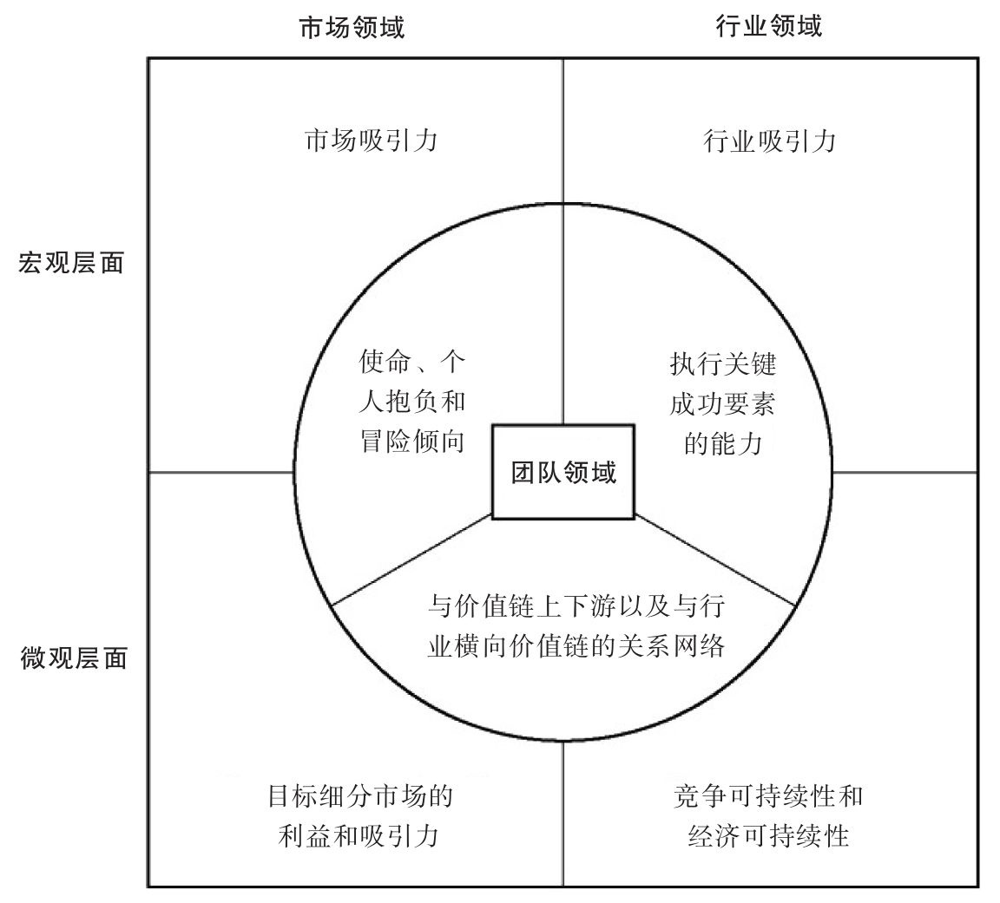
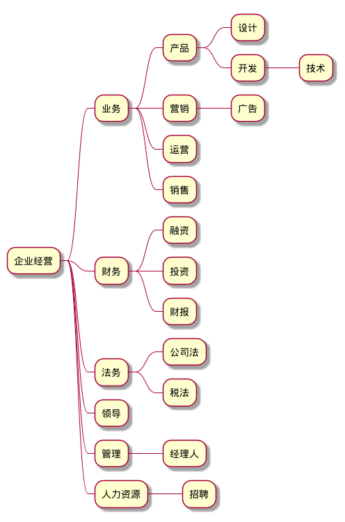

#+setupfile: ../setup.org

#+hugo_bundle: startup-theory
#+export_file_name: index

#+title: 创业理论
#+date: <2021-03-24 三 15:44>
#+hugo_categories: Startup
#+hugo_tags: life theory bussiness
#+hugo_draft: true
#+hugo_custom_front_matter: :comment false :featured_image images/featured.jpg

如何从空白开始驱动？

从小循环开始，不断壮大，多方面成长
从个人到团队

经营者本身是全知者，是资源的统筹者，
团结者，领导者，
将各个子方向的位置逐渐交出。

核心矛盾，既然企业经营者不会接触代码层面的工作，
自己辛苦钻研的目的何在呢？
跨越 GAP 的方式是什么呢？

* 创业理论
*** 技术创业
**** 如 PingCAP
*** 技术选型顾问
**** 所有技术的深入了解，业务需求的评测
*** 优秀的产品，都是合作的结果
*** 优秀的人都散落在哪里？

* 为什么

人生如此多方向，为什么要成为企业家

- 改变社会的力量
  - 自由经济，企业家的时代
  - 不是体制内，就是体制外

- 社会认知理论
  - 资本与工人
  - 财富的来源
    - 不是薪水，而是用户，一个运作的组织

- 人生价值
  - 物物交易到通用货币，
    物物交易，是需求的交换，
    有了货币之后，区分了生产者和消费者，
    有人专注于其它人的需求
  - 成为生产者
  - 被迫远离自己的目标
  - 不是学术研究，而是构建有用的软件
  - 离博士，学术研究越来越远
    - 以现实为界
    - 现世中的成就
    - 用商业证明自己

- 方向的选择
  - 事情都是有限的
  - 做同一件事，总在不断精进

* 思想

#+begin_quote
经济史，不过是一种假象。
你要认清它，再参与其中，不可反过来被愚弄
#+end_quote

- 如何开始
  
不知如何开始，
从理论开始，还未入局，但要先知道大家在玩什么游戏

太多事不知道如何处理，
过程中实时学习

创业难在思想上创造，
而思想创造来自于实践中的摸索。
这就成了鸡生蛋的问题

这只能大量参考别人的经验和案例，
从小处实践着手开始实践，慢慢来。

如果没有做出来，就说明自己没有真正的理解。

学习一件事，最终要实践。

比如经商，尝试的最小代价是什么？
少量投入，快速尝试，快速失败，原型，高保真

做之前，他是懂的
懂得如何做才能成功

现在对其，还是一个模糊的状态。
没有充分的理解，就无法做正确的规划。
而规划，是行动的第一步。

不像计算机，有一台 pc 就可以自由探索，
创业的实践成本是比较高的。

精益创业就是解决这个问题而生。

- 竞争优势

但是如果盲目开始，消耗了在技术上探索的时间，
产品就会变的低级。

其实技术只是其中一种竞争优势，并不是全部。

思考竞争优势，才是你要做的。
如果需要技术，就磨练技术。

专注于业务，而不是技术形式
解决客户的问题，就是你提供的价值

- 切入点   
  - 道，术，需求有一个重合点，才能 3 者都不违背，不违初心
  - 可成长的未来
  - 有没有一个领域，做到世界第一（由贸易战所想到）

- 需求第一
  - 商业是需求/业务为导向的
  - 可以做所有软件，是一种实力，但是实力用在什么有用的地方却不得而知
  - 应该关注实际的问题，实际的领域，从这个角度出发
  - sell me this pen，没有需求，也要创造需求
  - 人有吃喝玩乐的需求
  - 马斯洛的需求层次
  - 已有公司产品所满足的需求
  - 你无法教给专业人士更专业的东西，
    只能做出相应的产品，解决他们不太专业的地方遇到的问题
  - 拼命挖掘自己，表达自己，是本心；
    而拼命猜测别人想什么，需要什么，是商业定位
  - 只有接触到人，才能了解其需求

- 产品
  - 把优秀的解决方案，隐藏在简洁实用的产品中，
    而不是让用户困惑，觉得自己愚蠢

- 创业者
  - 投资人已经出钱，还要出想法，出管理，出运营不成？
    要怎么做，用什么方法，聪明，是创业者的工作，也是创业者的优势
  - 虽然创业者在多个方面是半桶水，
    但是结合起来是一种综合的力量
  - 领导者都是思考者，对于特定主题，有自己的想法和思考
  - 未来是软件方向，对于从事的方面，必定有自己独特的思考
  - 创造和解题是不同的。
    - 解题，有人命题，且题目是有解的，一定可以；
      而创造，需要自己找问题，问题是否成立，是否可解，都未可知

- 过程
  - 做大事，也要不断有正向的反馈，累积而来，
    而不是卧薪尝胆，十年之后，一步登天
  - 对事物的认知来自于建模，
    没有接触用户，没有接触投资人，所以都是未知数，
    无法建模，自然无法理解
  - 和成功的人合作
  - 抖音的火爆不是平台那么简单，而是部分人可以得到利益，由之引起的驱动
  - 公司的发展能否是自底向上的，由前线工作者主动，
    通常情况，命令从上而来，自顶向下
  - 开公司做自由职业的事情，可不太妙
  - 系统就是那些系统，人就是那些人，不过被资本，从一个地方，吸引到另一个地方
  - 万物都服从规律，有科学在内，
    创业是社会科学，而非自然科学，研究人，而不是自然
  - 了解他人的生存方式
  - 商业，和做其它事情一样，了解，实践，总结经验，做的更好。
    并不相信自己比他人多了/少了什么智慧而不能从事。

* 创业路径
** 挑选想法
*** 数据可视化
**** 人口数据
***** 商品销量的极限
***** 针对用户群的分布
**** 理解复杂系统的入口
**** 数据集
***** 打包出售
***** 随用随计
*** 名片设计业务
**** 电子名片
**** 信息加密
*** 教学实验用具
**** 物理小实验
**** 无法造出它，就不是真正的理解它
*** 自动化
**** 可取代人力的地方
**** 自动化测试
***** 完整的指标
*** 程序领域的基础项目
**** 浏览器
**** 文本编辑器
**** 编译器
*** 商场摄像头
**** 视频处理
**** 分析门店流量
**** 顾客意向
**** 商场店铺，人流分析
*** 组织写字楼清洁者
*** 检测手机套餐是否异常
*** 表情包
**** 简笔画
**** 编程领域的故事
**** 公司成长史
**** 程序员
**** PM
**** 小鸡鸭
**** 小黄牛，牛年说牛
**** 生肖系列
**** 小草鱼
*** 图书推荐引擎
**** 作者
**** 内链接
**** 书籍之间的相互引用
**** 内容相似性
*** 电脑绘图如手绘般简单
*** anki server service
*** 统计网站用户行为
**** 衡量创业指标
**** record and replay
*** 分布在世界各地的主机，对网站进行测试
**** ping
**** 功能测试
**** 可用性
*** 简单的绘图语言

 自己在制作 Lua图解的过程中，发现绘图始终是一个问题

 用编程语言绘图

 如 metapost tikz 需要对大小，颜色，从最底层开始构建
 是命令式的绘图语言

 如 graphviz 是描述性的绘图语言
 给出图的关系，剩下的由程序来安排

 如 ditaa 则是象形的绘图语言

 三者各有优势

 不过描述性，由于相应的限制，不能满足自己对所有细节的要求

 当前最合理的实践是，在命令式语言的上层，构建一种绘图抽象，用于绘制自己的图形
 也是一种 DSL 的思想吧

 - 高层抽象
 - 内部 arrange
 - 细节控制

 这三者，只有在完美理解自己的需求的前提下，才能用语言精准描述
 从这个角度看，DSL 也是用于解决问题的一种程序设计。

 通用的绘图语言？
 好像还不太理想，毕竟每个问题域，都有自身的独特的需要
*** 加盟模式

 之前在汇美相馆拍过照片，是一家小店，以加盟的名义，在“”汇美的招牌名义下

 但是这家店本身管理的并不算非常出色，这就带来一个问题，加盟模式是如何发挥作用的？

 对于总部而言，对于加盟商而言，其中的权衡关系。
*** 一种组织知识的方法

 每天遇到的知识都是零碎的片段

 但是不同的工具针对于不同的部分

 知识的来源是多向的，本身也归属于不同的方面

 比如
 邮件
 日历提醒
 即时通讯
 TODO 事项
 想法
 笔记
 书本 视频 音乐等不同的来源
 将所有遇到的，经历的，做一种整理，提炼出新的有益的东西

 个人数据的管理

 所有数据的归属与去向

 人生在世，关于自己的东西，定义了所有你在世时的痕迹

 - blog 想法，集结，可分享有价值的东西
 - 笔记
 - 日记
 - 软件，作为一种流程，属于一种特殊的数据
 - 使用过程中，对于不同软件的配置文件
 - 其它软件厂商的服务
 - 严格意义上讲，所下载的电影，之类，不属于定义“自己”的数据，不是自己的

 这一个概念和知识本身又产生了关联

 一个人脑中的认知，很大程度上决定了这个人，界定了这个人，“我思故我在”

*** 英文单词  搜索电视剧中出现过的场景

 字幕
 杂志
 书

 国际化 中文学习
*** 阅读源码

 技术的大潮在不断的变化，抓住本质的东西才能以不变应万变

 即使已经在领域中沉浸这么久，也没有抓住技术本身的驱动力

 技术本身是有趣的东西

 了解底层才能做到最好

 这一切并不神秘，打破技术壁垒

 只有了解深入工具内部原理，接触大型项目的构建过程，才能更上一层楼

 源码阅读过程中，实时在关键处加上注释 comment
 也可以就位置向他人提问

 和 ide 语言分析的位置关联
 这样就可以用一个 ref 时刻定位到
 关键数据/函数的位置
*** 纸质书，时刻做标注和笔记
**** 拍照
**** ocr
**** 标注选择
**** 可笔记的工具
*** lua 精通后的咨询

** 分析想法

判断创业者想进入的某一市场的吸引力，与判断创业者想进入的某一行业的吸引力，两者之间可能有天壤之别。为测评市场吸引力而提出的问题，与为测评行业吸引力而提出的问题，两者之间也大不相同。

人们很快就发现，就这些模式的服务对象而言，虽然有很多确实都处于有吸引力的市场，但却不处于有吸引力的行业中

*** 市场

    没有消费者，就没有需求；没有需求，就没有市场。

    这里的市场，代表的是买方这一方。

**** 微观

·是否有一个目标细分市场，你可以进入，并以消费者愿意支付的价格向他们提供明确的和有吸引力的利益（或更好的情况是）解决他们的痛苦？

·在消费者的头脑中，这些利益是否在某些方面与现有的其他解决方案不同—更好、更快、更便宜？等等。差异化至关重要，因为除了有一小部分新创企业可以在利基市场中避开竞争对手的火力而安全地成长外，绝大多数生产相同产品的跟随企业都会遭遇失败。

·这个目标细分市场的规模有多大，增长速度有多快？

·你所进入的这个目标细分市场是否会有利于进入你所期望的其他目标细分市场？

如何回答这些问题？最常见的做法是，首先获得第一手的原始数据（通过与潜在消费者会谈或调查），再结合间接数据（以前人们收集的、互联网上的、图书馆中的或来自其他来源的数据，以确定细分市场的规模和增长率），就可以得出创业者所需的答案。

很多有抱负的创业者常犯的错误是，只从宏观层面来考察市场吸引力。这种错误似乎在技术驱动型公司尤其普遍。这些公司的创业者不仅未能识别出谁是将要购买其产品的第一批消费者，乃至知道消费者的名字，以及消费者从中受益的原因 [8] ，而且也忽略了进入这个细分市场后可能为其将来进入其他细分市场创造的一个或多个机会 [9] ，所以，他们有可能出现进入了一条死胡同而无法继续发展的风险，这种风险体现在以下两方面：

·如果没有差异化的利益，那么大多数消费者就不会购买。

·如果没有增长的路径，那么大多数投资者就不会投资。

大多数细分市场的规模都太过狭小，难以长期维持一个高增长的企业，虽然对寻求进入利基市场或避开强有力的竞争对手而建立缓慢增长的生活方式型企业的创业者来说，这样的细分市场可能是相当有吸引力的。

当目标市场似乎已经给创业提供了一个成熟的机会，人们很容易受到诱惑而匆匆忙忙地启动创业过程。虽然迅速进入市场以获得先发优势的诱惑是很大的，但匆忙带来的结果绝对难以预料。对于多数情况来说，花点时间去识别和理解目标市场以找出消费者真正需要什么，要胜过早早地一头扎进去。

成功的企业以消费者为中心，而且为消费者的需求服务，并解决造成消费者痛苦的问题

1.是否有一个目标细分市场你可以进入，并以消费者愿意接受的价格向他们提供明确的和有吸引力的利益，或更好的情况是解决他们的痛苦？

2.在消费者看来，这些利益是否在某些方面与现有的其他解决方案是不同的—更好、更快、更便宜？等等，差异化是至关重要的。除了一小部分新创企业可以在利基市场中避开竞争对手的火力而安全地成长外，绝大多数跟着别人生产相同产品的跟随企业都会遭遇失败。

3.这个细分市场的规模有多大，增长速度有多快？

4.你所进入的这个细分市场是否会有利于进入你所期望的其他细分市场？

投资者（可以说是你的商业计划最重要的读者）想从微观市场的角度来了解哪些问题呢？

·首先，他们不想了解你的想法或产品—他们真的不在乎你和你的想法，至少一开始是这样的。他们想了解你的产品将如何解决消费者的痛苦。没有痛苦，就没有收获。如果你能识别出消费者的痛苦，那么你就可以让投资者注意到你。

·另外，对于一些“企业对终端消费者”（B2C）的机会来说，投资者将会很高兴看到消费者可以从中获得愉悦感，把以前的某个平凡经验变成一种愉悦。例如，星巴克或CaffèNero咖啡店所提供的与老式的咖啡店不同的体验，是另一种不同的发展方式，虽然做起来往往更难。

·投资者想知道目标消费者是谁，即那些有痛苦的或将获得愉悦的消费者是谁，他们希望有证据证明目标消费者将以他们可以接受的价格购买所提供给他们的产品。

这里的教训非常明确，创业者必须不辞辛劳地弄清楚目标市场，确定出他们目标市场的构成，并且他们必须能出示切实的证据，证明这个市场的消费者将会购买他们所提供的产品或服务。他们为什么会购买？为了获得其他解决方案不能提供的利益—更快、更好、更便宜等。没有利益，即没有痛苦的缓解或愉悦感的产生，就没有消费者，而没有消费者，企业就无法存在。

虽然称霸世界可能是他们的最终目标，但最成功的创业者通常都起步于一个单一的、有清楚界定的目标市场，而且往往是一个确实非常小的利基市场

界定细分市场的三种方法

1.按消费者来界定，也就是采用人口特征（年龄、性别、教育、收入等）作为判断标准。对于B2B的机会，人口特征是指企业客户经营业务的所在行业，加上企业客户的公司规模和其他公司特征。

2.按消费者所在地，即按地理位置来界定。

3.按消费者的行为方式，即按消费行为或生活方式来界定。对于B2B的机会，具体是指按产品使用方式上的区别来定义。例如，抽水机的生产商服务于广泛的细分市场，这取决于抽水机要抽的是什么（液体或气体，高黏度或低黏度等），以及是什么样的使用条件（例如，在寒冷温度下的西伯利亚冻土地带的油井中使用，还是在乳品厂严格的卫生条件下使用）。不同的细分市场有不同的需求，因此需要不同的解决方案。创业者向来为人们称道的是，他们可以为他们想进入的细分市场寻找新的方式，通常是行为上的新方式，从而创造一个他们能够在其中占据重要地位的新的细分市场。

消费者之所以会购买，归结起来都是为了利益，因为消费者购买的是利益，而不是特性—很多创业者无法理解这两者之间的区别。利益是主角，特性只是配角，它只是消费者寻求获得的利益的依托。我们所说的“利益”是什么意思呢？利益是使用产品时经常可以测量的最终结果（痛苦的缓解）而不是产品本身的某些物理属性。以比尔·鲍尔曼早期的跑步鞋为例，华夫饼饼铛沟槽状的鞋底和尼龙鞋面是特性（产品的物理属性），但这并不是运动员购买他们的运动鞋的原因。他们购买这些运动鞋，是为了保护自己在训练中不致受伤，是因为穿上它可以跑得更快。这些优点将这些运动鞋和其他鞋区别开来了，并决定了销售的成功。

耐克首先进入的是优秀长跑运动员市场，无论是对于当时还是对于现在，这个市场显然都是一个利基市场，耐克在这个细分市场中学会了经营，并建立了以下关键能力：

·了解这些优秀运动员需求的艺术。

·设计吸引这些运动员的产品的能力。

·在低成本的国外制造厂商中寻找产品供应商的能力。

·与高知名度运动员建立关系的能力。

·基于这些运动员的表现而进行营销推广，以吸引来自其他运动员的兴趣的能力。

然后，耐克利用这些能力进入其他细分市场。几乎在进入的每一个细分市场后，耐克都大获成功。

耐克这种一个细分市场接着一个细分市场的成功方式，引发了创业者应该问的几个问题：

·我从第一个细分市场中学到些什么来帮助我在其他细分市场中获得成功？

·还有其他细分市场也可以受益于所提供的产品吗？

·我们可以发展出把一个细分市场的成功复制到另一个细分市场的能力吗？

通过回答这些问题，创业者可以识别出目前的机会的额外价值—存在于最初目标市场之外的价值。正如耐克的案例研究所表明的，这个额外价值有可能是巨大的！

创业机会测试：第一阶段—微观层面的市场测试

·你提供的产品或服务能够解决消费者的哪些痛苦？或者你将用哪些令人愉悦的消费者体验来取代原来乏味的消费者体验？消费者把他们的钱给你的动力会强大到什么程度？在适合的价格条件下，鱼会咬钩吗？

·准确地说，那些有痛苦的或将获得愉悦感的消费者到底是谁？你有没有关于这些消费者的姓名、住址、工作单位或职位等详细的、准确的最新信息？

·你提供的产品或服务能提供哪些与众不同的利益，而且这些利益是其他解决方案不能提供的？

·你有什么证据能证明消费者将会购买你的产品或服务？

·你能提供什么样的证据来证明你的目标市场具有增长潜力？

·有没有其他细分市场可以受益于所提供的产品或服务？

·你能发展出把一个细分市场的成功复制到另一个细分市场的能力吗？

·基于你回答上述问题中收集到的证据，仍然存在哪些早期应该给予关注的微观市场风险？

     
**** 宏观

从宏观层面来对市场进行测评是一项相当简单的工作。通常，你首先可通过收集来自贸易出版物、商业评论等的间接资料来测评这个市场的规模有多大。市场规模有很多种衡量方法—当然，使用越多的衡量方法，衡量结果就越准确，具体的衡量方法有：

·衡量市场上的消费者（例如工作场所零食市场的消费者）的总人数。

·衡量这些消费者在相关商品（例如零食）或服务类别上所花费的总支出。

·衡量相关产品或服务（例如零食）的每年购买量。

你也要收集近年来的历史数据，以确定市场的发展速度有多快，并收集任何关于它在未来能以多快速度增长的现有预测。

然后你需要测评广泛的宏观环境趋势（简称宏观趋势），包括人口趋势、社会文化趋势、经济趋势、技术趋势、监管趋势以及自然环境趋势等，从而确定：未来形势会变好还是会变坏？ [6] 这个趋势是否有利于创业机会？或者，你将不得不在大潮中逆水行舟吗？

是一个能带来有吸引力的大市场的大机会，还是一个只能带来潜力有限的利基市场的小机会？当然这两种市场也许都是可以接受的，这取决于你的创业抱负。同样重要的是，你还要了解市场未来的发展方向。

*** 行业

    行业由卖方组成，提供产品，满足消费者。

    双方通过产品传递，在市场中交流。

正如严肃认真的创业者更倾向于进入有吸引力的市场一样，他们也更倾向于进入大多数参与者都能获得成功并获利的行业，而不愿意进入为了生存而拼命挣扎的行业；他们也更倾向基于竞争对手缺乏的某种可持续优势去参与竞争，并采用一种有利于产生持续现金流的商业模式。那么，这些关键性的判断是如何得出的呢？

**** 微观

要测评新创企业的可持续性，就需要联系其竞争对手来考察新创企业自身—无论它是一个全新的企业还是在现有企业内成立的新机构，目的是确定新创企业是否拥有某些因素，从而在不会迅速耗尽现金流的条件下，提高企业维持其最初优势的能力。这些因素是：

·其他公司无法复制或模仿的专有因素，如专利、商业秘密等。

·其他公司很难复制和模仿的更优秀的组织流程、能力或资源。 [12]

·具有经济可持续性商业模式，即公司不会很快就耗尽现金流。经济可持续性反过来在很大程度上取决于下面几个因素：

·与所需的资本投资和可得利润相关的收入要充足。

·赢得消费者和留住消费者的成本，以及赢得消费者所需时间要切合实际。

·总利润要足以支撑企业运作所需的固定成本结构。

·经营性现金周转的特征是有利的，即相对于企业所创造的利润，必须给库存等营运资本预留多少现金？消费者支付货款的速度如何？供应商和员工可以延迟多长时间支付？等等。 [13]

这里值得注意的是，是否拥有行业的第一手的经验，对于解决这些问题会带来大相径庭的结果。如果创业者了解这一领域，那么很快就能得出答案；而如果创业者不了解这一领域，就必须找到那些知道这些答案的人，在互联网上是不可能找到这些问题的全部答案的，向别人请教、打电话给可以帮助你的行业专家，这些做法也有助于建立起你的关系网络。

在微观层面上测评市场与行业的吸引力的重要原因是，即使是在宏观层面有吸引力的市场与行业里，如在金融服务和医药行业，也并不是所有的新创企业都可以获得成功的。新创企业在宏观层面上具有吸引力，并不等于拥有了一切，更重要的成功因素是，在微观层面的行业吸引力测评也能获得积极的结果。

**** 宏观

竞争，五力模型

·新进入者的威胁。

·购买者的议价能力。

·供应商的议价能力。

·替代品的威胁。

·同业竞争者的竞争程度。

*** 团队
    
该机会是否与团队的使命、个人抱负和冒险倾向相一致，而且所有这些使命、个人抱负和冒险倾向是否与潜在投资者的使命、个人抱负和冒险倾向相一致？

·假设团队已经具备了关键成功要素（所谓关键成功要素是指，只要做对了就几乎确保可获得卓越绩效，即使其他事情没有做对；而只要做错了，就会对绩效产生严重的负面影响，即使其他事情都做对），那么团队是否拥有利用这个特殊机会来实现卓越绩效的能力？即团队成员掌握了必要的经验和行业诀窍？

·团队是否与价值链上下游以及与行业横向价值链都建立了良好的关系网络，可以很快地注意到任何可能改变其发展道路的机会或需要，假设条件许可的话？

**** 使命、个人抱负和冒险倾向
     
在进行机会测评时，创业者和投资者往往会带着一定程度的个人偏好，这种个人偏好通常体现在以下方面：

·他们希望为之服务的市场（自己就是运动员出身的耐克创始人菲尔·奈特想向运动员推销）。

·他们愿意参与竞争的行业（对于奈特来说，就是运动鞋行业）。

·他们自己的抱负。（创建多大的企业，如果想退出，要多长时间退出；是要全身心投入这个机会吗？或者只是购买一个期权，看它是否可以成功？）

·他们愿意承担的风险。（投入多少资金？创建成功企业的信念有多坚定？是自己控制还是与他人分享该企业？）

如果所测评的机会不符合这些个人偏好，则认为该机会是缺乏吸引力的，尽管具有不同个人偏好和梦想的其他创业者可能会认为该机会很有吸引力。

**** 团队执行关键成功要素的能力

**** 团队与价值链上下游以及与行业横向价值链建立的关系网络

     

** 设计商业模式

** 精益测试

** 然后？

* 能力补足

#+begin_src plantuml :file images/business-roadmap.png :cmdline -charset utf-8
\@startmindmap
+ 企业经营

++ 业务
+++ 产品
++++ 设计
++++ 开发
+++++ 技术
+++ 营销
++++ 广告
+++ 运营
+++ 销售

++ 财务
+++ 融资
+++ 投资
+++ 财报

++ 法务
+++ 公司法
+++ 税法

++ 领导
++ 管理
+++ 经理人
++ 人力资源
+++ 招聘
\@endminmap
#+end_src

#+RESULTS:

** 业务
** 财务
** 法务

- 公司法
- 合同法

** 管理
** 采购

** 产品

商业最基础的形态，即是产品和销售。产品是你从事商业活动的本源。

产品，来源于需求。
只有满足需求的产品，才是有用的，可以流通的。

** 营销

https://www.zhihu.com/question/20047841

** 销售

完成销售，完成产品的流转，才有利润，才是完成的商业行为。

销售，就是要面对人。

