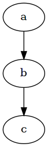

#+setupfile: ../setup.org

#+hugo_bundle: ox-hugo-example
#+export_file_name: index

#+title: test ox hugo workflow
#+date: <2021-02-20 六 11:25>
#+hugo_categories: test
#+hugo_tags: test emacs
#+hugo_draft: true
#+hugo_custom_front_matter: :featured_image images/test.png :enableMathJax true :comment false

* ox hugo test page
  
** header 2
   
*** header 3

#+begin_src dot :file images/test.png
digraph {
a -> b -> c;
}
#+end_src

#+RESULTS:

LaTeX formatted equation: \( E = -J \sum_{i=1}^N s_i s_{i+1} \)

If $a^2=b$ and \( b=2 \), then the solution must be either
$$ a=+\sqrt{2} $$ or \[ a=-\sqrt{2} \newline
newline
\]

hello world
